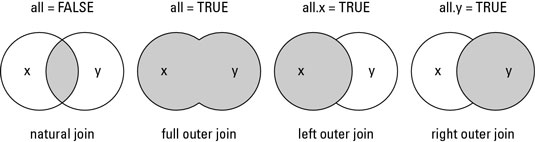

source: Stat Resural/Codes regroupement_ORUMIP/analyse_regroup.Rmd

Analyse du fichier transmis par l'ORUMIP
========================================
 
Le fichier Regroupements ORUMiP Thésaurus SFMU.csv doit être enregistré en inclant les guillemets entre les différents champs à cause des apostophes. La ligne 1 doit être supprimée.

dictionnaire des termes
-----------------------
- GAUX: signes généraux et autres pathologies
- MLSV: malaises, syncope

Le fichier de travail __d3__ est préparé à partir de __d14__ pour les données 2014 et le fichier de regroupement de l'Orumip (version 2). Les fichiers sources sont mergés sur la base des codes CIM10. Les codes CIM10 Orumip respectent la nomenclature PMSI avec des détails supplémentaires précédés du signe +.

Pour le calcul des horaires de PDS il faut rajouter le fichier __Trame commune/horaires_pds.Rda__.

Le 6/6/2015 ajout de la colonne SORTIE dans d3 pour pouvoir calculer une durée de présence en fonction de la pathologie.

```{r preparation}
library(knitr)
options(scipen = 6, digits = 2)

# # Pour MAC:
# path <- "Regroupement_ORUMIP"
# d <- read.csv2(paste(path, file2, sep="/"), skip = 1)
# load("../RPU_2014/rpu2014d0112_c2.Rda") # d14
# load("~/Documents/RESURAL/Trame_Commune/horaires_pds.Rda") #h.pds
# 
# # 
# # Pour XPS
# # path <- "../Regroupement_ORUMIP"
# # file2 <- "REGROUPEMENT-CIM10-FEDORU-V2.csv"
# 
# # on récupère la nomenclature de l'Orumip
# d <- read.csv2(paste(path, file2, sep="/"), skip = 1)
# # save(d, file = "../Regroupement_ORUMIP/REGROUPEMENT-CIM10-FEDORU-V2.Rda")
# 
# # # DP 2014
# # load("~/Documents/Resural/Stat Resural/RPU_2014/rpu2014d0112_c2.Rda") # d14
# 
# # Ajout des horaires de PDS
# d14$HPDS <- h.pds
# 
# # Sélestion des colonnes utiles
# dpr2 <- d14[!is.na(d14$DP), c("DP","CODE_POSTAL","ENTREE","SORTIE", "FINESS","GRAVITE","ORIENTATION","MODE_SORTIE","AGE","SEXE","TRANSPORT","DESTINATION","NAISSANCE", "HPDS")]
# 
# # correction des caractères bloquants
# dpr2$DP<-gsub("\xe8","è",as.character(dpr2$DP),fixed=FALSE)
# dpr2$DP<-gsub("\xe9","é",as.character(dpr2$DP),fixed=FALSE)
# 
# # suppression des points décimaux
# dpr2$DP <- gsub(".", "", dpr2$DP, fixed=TRUE)
# 
# # suppression des minuscules
# dpr2$DP <- toupper(dpr2$DP)
# # save(dpr2, file = "dpr2.Rda")
# 
# # on réalise un merging des deux fichiers sur la base du code CIM 10
# d3 <- merge(dpr2, d, by.x = "DP", by.y = "Code", all.x = TRUE)
# save(d3, file = "d3.Rda") # d3
# 
# # ménage
# rm(d14, d, dpr2)

```

Fichier des codes de regroupement ORUMIP
========================================

Analyse du fichier source de l'ORUMIP.
```{r}
path <- "../Regroupement_ORUMIP/Old Regroupement/" # en mode console path <- "Regroupement_ORUMIP"
# file <- "Regroupements ORUMiP Thésaurus SFMU.csv"
file2 <- "REGROUPEMENT-CIM10-FEDORU-V2.csv"

# on récupère la nomenclature de l'Orumip
#d <- read.csv(paste(path, file, sep="/"), skip = 1)
d <- read.csv2(paste(path, file2, sep="/"), skip = 1)

names(d)
```
Retrouver tous les codes CIM10 correspondants à une gastro-entérite:

```{r}
ge <- d[which(d$SOUS.CHAPITRE == "Diarrhée et gastro-entérite"),]

```
On rouve 91 codes. Les GE habituelles sont regroupées par les codes commençant par __A0__. Wikipédia rapporte aussi le code __J10.8__, __J11.8__ (GE grippale), 

Création  d'un nouveau fichier août 2015
========================================

L'objectif est de créer un fichier résultant du merging des RPU 2015 et des codes de regroupement ORUMIP.

Récupération des codes de regroupement
--------------------------------------
Les codes de regroupement sont fournis sous forme d'un classeur Excel.

- création d'un nouveau dossier: Regroupement_ORUMIP/Regroupement_ORUMIP/
- on y met _Regroupements ORUMiP Thésaurus SFMU.xlsx_. Le 22/11/2015 on le remplace par le fichier __REGROUPEMENT-CIM10-FEDORU-V2.xlsx__ récupéré sur le site de la FEDORU.
- on sauvegarde _REGROUPEMENT-CIM10-FEDORU-V2.xlsx_ au format .CSV2 (semi-colon) car le tableur posssède des rubriques où les mots sont séparés par des virgules, sous le nom de __REGROUPEMENT-CIM10-FEDORU-V2.csv__.
- Le fichier CSV récupéré sous le nom __orumip__ et sauvegardé au format R sous __orumip.Rda__.

```{}
# pour mac en mode console
path <- "Regroupement_ORUMIP/Regroupement_ORUMIP/"
file <- "REGROUPEMENT-CIM10-FEDORU-V2.csv"
orumip <- read.csv2(paste0(path, file), skip = 2)

```

On renomme les entête de colonnes
```{}
x <- c("CIM10", "LIBELLE_CIM10", "SFMU", "TYPE_URGENCES", "CHAPITRE","SOUS_CHAPITRE")
names(orumip) <- x

names(orumip)
head(orumip)

# enregistrement au format R
write.csv2(orumip, file = "orumip.Rda")
```

Récupération des RPU 2015
-------------------------
Le ficher des RPU récupéré et nettoyé (on ne conserve que les RPU dont le DP est renseigné) est sauvegardé sous le nom de __dpr2.Rda__.

Lecture du fichier des RPU 2015
```{}
load("../RPU_2014/rpu2015d0112_provisoire.Rda") # d15
# load("~/Documents/RESURAL/Trame_Commune/horaires_pds.Rda") #h.pds

# On ne garde que les RPU avec un DP
dpr2 <- d15[!is.na(d15$DP), ]
```

supression des caractères anormaux
```{}
Encoding(dpr2$DP) <- "latin1"
Encoding(dpr2$MOTIF) <- "latin1"
```

suppression des points décimaux
```{}
dpr2$DP <- gsub(".", "", dpr2$DP, fixed=TRUE)
```

suppression des minuscules
```{}
dpr2$DP <- toupper(dpr2$DP)
```

Sauvegarde du fichier dpr2
```{}
save(dpr2, file = "Regroupement_ORUMIP/dpr2.Rda")

save(dpr2, file = "dpr2.Rda")
```

Merging des 2 fichiers
-----------------------
Le fichier résultant est sauvegardé sous le nom de __merge2015.Rda__.

on réalise un merging des deux fichiers sur la base du code CIM 10
```{}
merge2015 <- merge(dpr2, orumip, by.x = "DP", by.y = "CIM10", all.x = TRUE)

# sauvegarde obsolète
save(merge2015, file = "Regroupement_ORUMIP/merge2015.Rda") # merge2015

# sauvegarde
save(merge2015, file = "merge2015.Rda") # merge2015
```

Analyse rapide
--------------
On utilise le fichier __merge2015.Rda__ créé à l'étape précédente, résultant du croisement des RPU 2015 (au 5 novembre 2015) et des code de regroupement ORUMIP. Les codes CIM10 sont dans la colonne DP.

```{r}
load("../Regroupement_ORUMIP/merge2015.Rda")
head(merge2015)

table(merge2015$TYPE_URGENCE)
table(merge2015$CHAPITRE)
table(merge2015$SOUS_CHAPITRE)

# table des CODE_URGENCE par FINESS
t <- tapply(merge2015$TYPE_URGENCE, list(merge2015$FINESS, merge2015$TYPE_URGENCE), length)
t

# somme d'une ligne et % de cas par FINESS
b <- apply(t, 1, sum, na.rm = TRUE)
round(t*100/b, 2)

# total par colonne et pourcentage
a <- apply(t, 2, sum, na.rm = TRUE) # somme des colonnes
a
round(a * 100/sum(a), 2)


# manipulation d'une ligne
t['NHC',]
sum(t['NHC',])
t['NHC',] / sum(t['NHC',])
round(t['NHC',]*100 / sum(t['NHC',]), 2)

# table des CODE_DISCIPLINE par FINESS
t <- tapply(merge2015$CHAPITRE, list(merge2015$FINESS, merge2015$CHAPITRE), length)

```

Codes non reconnus
------------------

De nombreux codes ne sont pas reconnus par le fichier de regroupement. Il faut donc les remplacer par des codes de substitutions reconnus par le fichier de regroupement (orumip). Le nombre de codes de sustitution étant important, il est plus facile de les regrouper dans le fichier __codes_remplacement.csv__ qui peut être mis à jour régulièrement à partir du fichier __codes_remplacement.ods__.

NB: certains codes restent inexploitables car sans correspondance dans le thésaurus. Par exemple W199 correspond aux chutes sans précisions. D'une manière générale, les codes commençant par U, V, W, X, Y n'ont pas de correspondance. La version 8 du cahier des charges de l'InVS recommande d'appliquer la méthodologie PMSI, c'est à dire de ne pas utiliser les codes qui sont interdits en diagnostic principal. Par exemple le code R53 (malaise et fatigue) n'est pas un DP. Il faut utiliser R53.0 (Altération de l'état général) ou R53.1 (malaise) ou R53.2 (fatigue) qui sont reconnus comme DP.

```{r}
library(epicalc)
tab1(merge2015$LIBELLE_CIM10, graph = FALSE)
a <- merge2015[is.na(merge2015$LIBELLE_CIM10),]
x <- cbind(summary(as.factor(a$DP)))
head(x)

```
Codes de remplacement
---------------------
- S060 commotion cérébrale (DP) -> S0600
- M796	Douleur au niveau d'un membre (DP) -> M7969
- R520  Douleur aiguë (DP) -> R529
- A09  Autres gastroentérites et colites d'origine infectieuse ou non précisée (non DP): -> A090
- M545  Lombalgie basse (DP) -> M5456
- F100  Troubles mentaux et du comportement liés à l'utilisation d'alcool : intoxication aiguë (F1000)
- S836  Entorse et foulure de parties autres et non précisées du genou -> S830
- Z028  Autres examens à des fins administratives -> Z022
- S525  Fracture de l'extrémité inférieure du radius	-> 5250
- T149  Lésion traumatique, sans précision -> T140
- R53  Malaise et fatigue <- R53+1 (malaises)
- H669  Otite moyenne, sans précision -> H660
- J039  Amygdalite , sans précision <- H605
- H103  Conjonctivite aiguë, sans précision -> H100
- W199  Chute, sans précision, lieu sans précision -> Pas de correspondance. N'est pas un DP
- M544  Lumbago avec sciatique -> M5446
- M791  Myalgie -> M7919
- J180  Bronchopneumopathie, sans précision	<- J189
- S626	Fracture d'un autre doigt -> 6260
- M542	Cervicalgie -> M5422

- M779   M7799
- M543   M5437
- T119   T220
- R002   R000
- S01    S010
- H609   H605
- J31    J310
- M5459  M5456
- R10    R100
- N12    N10
- T131   S910
- W570   T634
- V899   
- S623   S6230
- J038   J069
- H109   H100
- Y099   
- T159   T150
- J03    J00
- J21    J210

Les codes de remplacement sont stockés dans le fichier __Analyse-regroupements/codes_remplacement.csv__. Le fichier comporte 2 colonnes:

- les codes RPU
- les codes de remplacement compatibles avec le thésaurus de regroupment


Récupération du fichier des codes de substitution:
```{r}
# récupère le fichier des codes de substitution
# mode console: file <- "Analyse_regroupements/codes_remplacement.csv"
file <- "codes_remplacement.csv"
sub <- read.csv(file)
n <- nrow(sub)
sub$CODE_RPU <- as.character(sub$CODE_RPU)
sub$SUBSTITUTION <- as.character(sub$SUBSTITUTION)

```

Le fichier __dpr2__ doit être corrigé avant le merging
```{r}

# substitue les codes dans dpr2

load("../Regroupement_ORUMIP/dpr2.Rda")
load("../Regroupement_ORUMIP/orumip.Rda")

for(i in 1:n){
  dpr2$DP[dpr2$DP == sub$CODE_RPU[i]] <- sub$SUBSTITUTION[i]
  }

# merge avec le fichier de regroupement ORUMIP

merge2015 <- merge(dpr2, orumip, by.x = "DP", by.y = "CIM10", all.x = TRUE)

# controle
a <- merge2015$CODE_URGENCE
sum(is.na(a))
a <- merge2015$DP[is.na(merge2015$CODE_URGENCE)]
head(a)
head(summary(as.factor(a)))

# sauve le fichier merge
save(merge2015, file = "../Regroupement_ORUMIP/merge2015.Rda") # merge2015

```

Longueur des codes CIM10
```{r}
a <- dpr2$DP
summary(as.factor(nchar(a)))
```

Codes anormaux
```{r}
a[which(nchar(a)==1)]
a[which(nchar(a)==7)]
a[which(nchar(a)==8)]
a[which(nchar(a)==18)]

```


Commentaires
------------
Au moment du merging on veut que toute la colonne DP soit prise en compte. Il faut donc préciser _all.x = TRUE_ 
. 

Explications: [How to Use the merge() Function with Data Sets in R](http://www.dummies.com/how-to/content/how-to-use-the-merge-function-with-data-sets-in-r.html). Les codes n'ayant pas de correspondance FEDORU sont marqués NA. 

