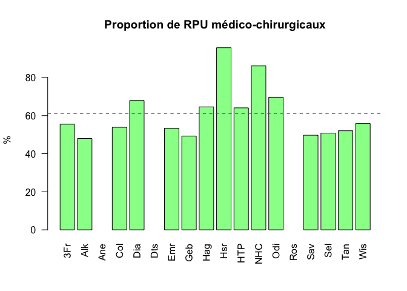
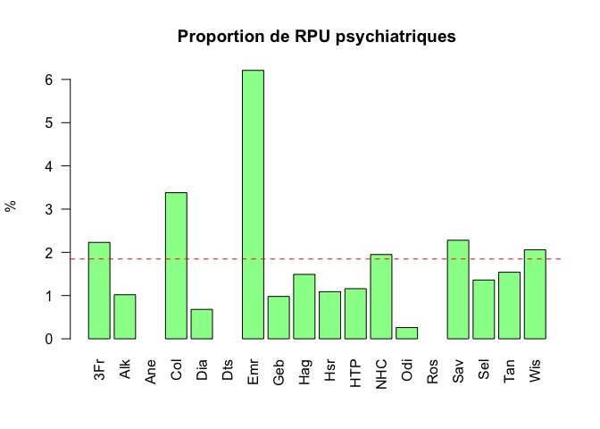
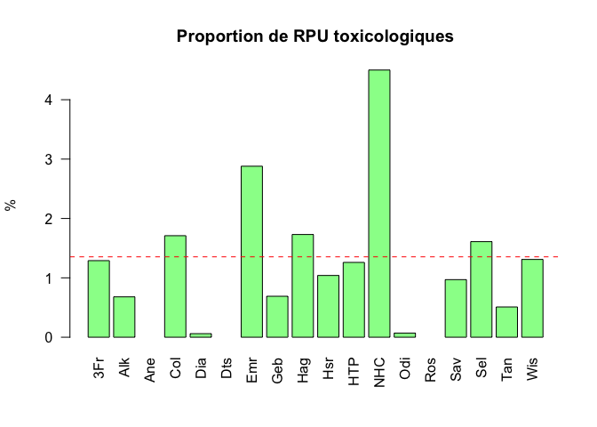
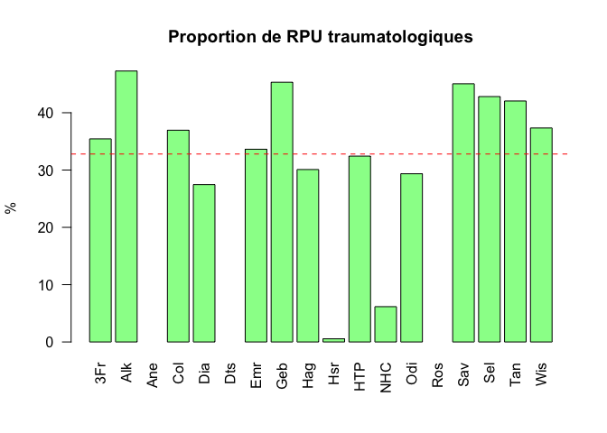

# Analyse par codes de regroupement
JcB  
03/12/2014  

source: Stat Resural/Codes regroupement_ORUMIP/analyse_regroup.Rmd

Analyse du fichier transmis par l'ORUMIP
========================================
 
Le fichier Regroupements ORUMiP Thésaurus SFMU.csv doit être enregistré en inclant les guillemets entre les différents champs à cause des apostophes. La ligne 1 doit être supprimée.

dictionnaire des termes
-----------------------
- GAUX: signes généraux et autres pathologies
- MLSV: malaises, syncope

Le fichier de travail __d3__ est préparé à partir de __d14__ pour les données 2014 et le fichier de regroupement de l'Orumip (version 2). Les fichiers sources sont mergés sur la base des codes CIM10. Les codes CIM10 Orumip respectent la nomenclature PMSI avec des détails supplémentaires précédés du signe +.

Pour le calcul des horaires de PDS il faut rajouter le fichier __Trame commune/horaires_pds.Rda__.

Le 6/6/2015 ajout de la colonne SORTIE dans d3 pour pouvoir calculer une durée de présence en fonction de la pathologie.


```r
library(knitr)
options(scipen = 6, digits = 2)

# # Pour MAC:
# path <- "Regroupement_ORUMIP"
# d <- read.csv2(paste(path, file2, sep="/"), skip = 1)
# load("../RPU_2014/rpu2014d0112_c2.Rda") # d14
# load("~/Documents/RESURAL/Trame_Commune/horaires_pds.Rda") #h.pds
# 
# # 
# # Pour XPS
# # path <- "../Regroupement_ORUMIP"
# # file2 <- "REGROUPEMENT-CIM10-FEDORU-V2.csv"
# 
# # on récupère la nomenclature de l'Orumip
# d <- read.csv2(paste(path, file2, sep="/"), skip = 1)
# # save(d, file = "../Regroupement_ORUMIP/REGROUPEMENT-CIM10-FEDORU-V2.Rda")
# 
# # # DP 2014
# # load("~/Documents/Resural/Stat Resural/RPU_2014/rpu2014d0112_c2.Rda") # d14
# 
# # Ajout des horaires de PDS
# d14$HPDS <- h.pds
# 
# # Sélestion des colonnes utiles
# dpr2 <- d14[!is.na(d14$DP), c("DP","CODE_POSTAL","ENTREE","SORTIE", "FINESS","GRAVITE","ORIENTATION","MODE_SORTIE","AGE","SEXE","TRANSPORT","DESTINATION","NAISSANCE", "HPDS")]
# 
# # correction des caractères bloquants
# dpr2$DP<-gsub("\xe8","è",as.character(dpr2$DP),fixed=FALSE)
# dpr2$DP<-gsub("\xe9","é",as.character(dpr2$DP),fixed=FALSE)
# 
# # suppression des points décimaux
# dpr2$DP <- gsub(".", "", dpr2$DP, fixed=TRUE)
# 
# # suppression des minuscules
# dpr2$DP <- toupper(dpr2$DP)
# # save(dpr2, file = "dpr2.Rda")
# 
# # on réalise un merging des deux fichiers sur la base du code CIM 10
# d3 <- merge(dpr2, d, by.x = "DP", by.y = "Code", all.x = TRUE)
# save(d3, file = "d3.Rda") # d3
# 
# # ménage
# rm(d14, d, dpr2)
```

Fichier des codes de regroupement ORUMIP (chapitre obsolète)
========================================

Analyse du fichier source de l'ORUMIP.
```{}
path <- "../Regroupement_ORUMIP/Old Regroupement/" # en mode console path <- "Regroupement_ORUMIP"
# file <- "Regroupements ORUMiP Thésaurus SFMU.csv"
file2 <- "REGROUPEMENT-CIM10-FEDORU-V2.csv"

# on récupère la nomenclature de l'Orumip
#d <- read.csv(paste(path, file, sep="/"), skip = 1)
d <- read.csv2(paste(path, file2, sep="/"), skip = 1)

names(d)
```
Retrouver tous les codes CIM10 correspondants à une gastro-entérite:

```{}
ge <- d[which(d$SOUS.CHAPITRE == "Diarrhée et gastro-entérite"),]

```
On rouve 91 codes. Les GE habituelles sont regroupées par les codes commençant par __A0__. Wikipédia rapporte aussi le code __J10.8__, __J11.8__ (GE grippale), 

Création  d'un nouveau fichier août 2015
========================================

L'objectif est de créer un fichier résultant du merging des RPU 2015 et des codes de regroupement ORUMIP.

Récupération des codes de regroupement ORUMIP
---------------------------------------------

NB: Ce paragraphe n'est à exécuter que lors d'une mise à jour du Thésaurus.

Le thésaurus de l'ORUMIP est fourni sous la forme d'un classeur Excel. Il faut d'abord le convertir en fichier _.csv_. Puis il faut nettoyer les données:

- renommer les colonnes qui comprtent des blancs, des accents et un intitulé trop long

Les codes de regroupement sont fournis sous forme d'un classeur Excel.

- création d'un nouveau dossier: Regroupement_ORUMIP/Regroupement_ORUMIP/
- on y met _Regroupements ORUMiP Thésaurus SFMU.xlsx_. Le 22/11/2015 on le remplace par le fichier __REGROUPEMENT-CIM10-FEDORU-V2.xlsx__ récupéré sur le site de la FEDORU.
- on sauvegarde _REGROUPEMENT-CIM10-FEDORU-V2.xlsx_ au format .CSV2 (semi-colon) car le tableur posssède des rubriques où les mots sont séparés par des virgules, sous le nom de __REGROUPEMENT-CIM10-FEDORU-V2.csv__.
- Le fichier CSV récupéré sous le nom __orumip__ et sauvegardé au format R sous __orumip.Rda__.

```{}
# pour mac en mode console
path <- "Regroupement_ORUMIP/Regroupement_ORUMIP/"
file <- "REGROUPEMENT-CIM10-FEDORU-V2.csv"
orumip <- read.csv2(paste0(path, file), skip = 2)

```

On renomme les entête de colonnes
```{}
x <- c("CIM10", "LIBELLE_CIM10", "SFMU", "TYPE_URGENCES", "CHAPITRE","SOUS_CHAPITRE")
names(orumip) <- x

names(orumip)
head(orumip)

# enregistrement au format R
write.csv2(orumip, file = "orumip.Rda")
```

Récupération des RPU 2015
-------------------------

NB: ce paragraphe est à exécuter chaque fois que le fichier des RPU est mis à jour.

Le ficher des RPU récupéré et nettoyé (on ne conserve que les RPU dont le DP est renseigné) est sauvegardé sous le nom de __dpr2.Rda__.

Lecture du fichier des RPU 2015
```{}
load("../RPU_2014/rpu2015d0112.Rda") # d15
# load("~/Documents/RESURAL/Trame_Commune/horaires_pds.Rda") #h.pds

# On ne garde que les RPU avec un DP
dpr2 <- d15[!is.na(d15$DP), ]
```

supression des caractères anormaux
```{}
Encoding(dpr2$DP) <- "latin1"
Encoding(dpr2$MOTIF) <- "latin1"
```

suppression des points décimaux
```{}
dpr2$DP <- gsub(".", "", dpr2$DP, fixed=TRUE)
```

suppression des minuscules
```{}
dpr2$DP <- toupper(dpr2$DP)
```

Sauvegarde du fichier dpr2
```{}
save(dpr2, file = "Regroupement_ORUMIP/dpr2.Rda")

# save(dpr2, file = "dpr2.Rda")
```

Merging des 2 fichiers
-----------------------
Le fichier résultant est sauvegardé sous le nom de __merge2015.Rda__.

on réalise un merging des deux fichiers sur la base du code CIM 10
```{}
load("Regroupement_ORUMIP/orumip.Rda") # orumip
merge2015 <- merge(dpr2, orumip, by.x = "DP", by.y = "CIM10", all.x = TRUE)

# sauvegarde
save(merge2015, file = "Analyse_regroupements/merge2015.Rda") # merge2015

# sauvegarde obsolète
#save(merge2015, file = "merge2015.Rda") # merge2015
```

Mise à jour courante
====================

Ce paragraphe décrit comment faire une mise à jour du fichier des regroupement de DP de l'année en cours. Principe:

- préparer les DP à partir du fichier des RPU courants
- récupérer le fichier des regroupements de la FEDORU
- merger les deux fichiers


```r
anc <- 2016
load(paste0("../../DATA/RPU_",anc, "/rpu", anc, "d0112.Rda")) # d16
dx <- d16
```

```r
# préparation des DP valides
source("analyse_regroupement.R")
dpr2 <- dpr(dx) 
```

```r
# Sauvegarde du fichier dpr2
save(dpr2, file = paste0("../Regroupement_ORUMIP/dpr2_", anc, ".Rda"))
```

```r
# on réalise un merging des deux fichiers sur la base du code CIM 10
load("../Regroupement_ORUMIP/orumip.Rda") # orumip
merge2016 <- merge(dpr2, orumip, by.x = "DP", by.y = "CIM10", all.x = TRUE)
# sauvegarde
save(merge2016, file = paste0("merge", anc, ".Rda")) # merge2016
```

Analyse du fichier


```r
# Analyse du fichier créé
merge<- merge2016
tu <- table(merge$TYPE_URGENCE)
chap <- table(merge$CHAPITRE)
sc <- table(merge$SOUS_CHAPITRE)
round(prop.table(tu) * 100, 2)
```

```
## 
##      Autre recours Médico-chirurgical      Psychiatrique 
##                2.8               60.6                2.2 
##      Toxicologique    Traumatologique 
##                1.5               32.9
```

```r
# Type _Urgence par Finess
tu.fness <- tapply(merge$TYPE_URGENCES, list(merge$TYPE_URGENCES, merge$FINESS), length)
tu.fness
```

```
##                     3Fr Alk Ane  Col  Dia Dts  Emr  Geb  Hag  Hsr  HTP
## Autre recours       159  18   3  521  200  NA  322  125  166   57  120
## Médico-chirurgical 1591 282 447 6858 3519 207 4394 1652 5125 3321 7151
## Psychiatrique        64   6   1  430   35  NA  511   33  118   38  129
## Toxicologique        37   4  NA  218    3  NA  237   23  137   36  141
## Traumatologique    1016 278 267 4705 1422 641 2769 1519 2387   19 3619
##                     NHC  Odi Ros  Sav  Sel Tan  Wis
## Autre recours        44   20  NA   52  220  15   86
## Médico-chirurgical 3004 2139  NA 1285 3290 203 1413
## Psychiatrique        68    8  NA   59   88   6   52
## Toxicologique       157    2  NA   25  104   2   33
## Traumatologique     215  901  80 1165 2772 164  944
```

```r
p.tu.fness <- round(prop.table(tu.fness, 2) * 100, 2)
p.tu.fness
```

```
##                     3Fr   Alk Ane  Col   Dia Dts  Emr   Geb  Hag   Hsr
## Autre recours       5.5  3.06  NA  4.1  3.86  NA  3.9  3.73  2.1  1.64
## Médico-chirurgical 55.5 47.96  NA 53.9 67.95  NA 53.4 49.28 64.6 95.68
## Psychiatrique       2.2  1.02  NA  3.4  0.68  NA  6.2  0.98  1.5  1.09
## Toxicologique       1.3  0.68  NA  1.7  0.06  NA  2.9  0.69  1.7  1.04
## Traumatologique    35.4 47.28  NA 37.0 27.46  NA 33.6 45.32 30.1  0.55
##                     HTP  NHC   Odi Ros   Sav  Sel   Tan  Wis
## Autre recours       1.1  1.3  0.65  NA  2.01  3.4  3.85  3.4
## Médico-chirurgical 64.1 86.1 69.67  NA 49.69 50.8 52.05 55.9
## Psychiatrique       1.2  1.9  0.26  NA  2.28  1.4  1.54  2.1
## Toxicologique       1.3  4.5  0.07  NA  0.97  1.6  0.51  1.3
## Traumatologique    32.4  6.2 29.35  NA 45.05 42.8 42.05 37.3
```

```r
# % moyen
mean.p.tu.fness <- apply(p.tu.fness, 1, mean, na.rm = T)
cbind(p.tu.fness, mean.p.tu.fness)
```

```
##                     3Fr   Alk Ane  Col   Dia Dts  Emr   Geb  Hag   Hsr
## Autre recours       5.5  3.06  NA  4.1  3.86  NA  3.9  3.73  2.1  1.64
## Médico-chirurgical 55.5 47.96  NA 53.9 67.95  NA 53.4 49.28 64.6 95.68
## Psychiatrique       2.2  1.02  NA  3.4  0.68  NA  6.2  0.98  1.5  1.09
## Toxicologique       1.3  0.68  NA  1.7  0.06  NA  2.9  0.69  1.7  1.04
## Traumatologique    35.4 47.28  NA 37.0 27.46  NA 33.6 45.32 30.1  0.55
##                     HTP  NHC   Odi Ros   Sav  Sel   Tan  Wis
## Autre recours       1.1  1.3  0.65  NA  2.01  3.4  3.85  3.4
## Médico-chirurgical 64.1 86.1 69.67  NA 49.69 50.8 52.05 55.9
## Psychiatrique       1.2  1.9  0.26  NA  2.28  1.4  1.54  2.1
## Toxicologique       1.3  4.5  0.07  NA  0.97  1.6  0.51  1.3
## Traumatologique    32.4  6.2 29.35  NA 45.05 42.8 42.05 37.3
##                    mean.p.tu.fness
## Autre recours                  2.9
## Médico-chirurgical            61.1
## Psychiatrique                  1.8
## Toxicologique                  1.4
## Traumatologique               32.8
```

```r
# Aspect graphique
barplot(p.tu.fness[2,], las = 2, main = "Proportion de RPU médico-chirurgicaux", ylab = "%", col = "palegreen")
abline(h = mean.p.tu.fness[2], col = "red", lty = 2)
```



```r
barplot(p.tu.fness[3,], las = 2, main = "Proportion de RPU psychiatriques", ylab = "%", col = "palegreen")
abline(h = mean.p.tu.fness[3], col = "red", lty = 2)
```



```r
barplot(p.tu.fness[4,], las = 2, main = "Proportion de RPU toxicologiques", ylab = "%", col = "palegreen")
abline(h = mean.p.tu.fness[4], col = "red", lty = 2)
```



```r
barplot(p.tu.fness[5,], las = 2, main = "Proportion de RPU traumatologiques", ylab = "%", col = "palegreen")
abline(h = mean.p.tu.fness[5], col = "red", lty = 2)
```



Analyse rapide
--------------
On utilise le fichier __merge2015.Rda__ créé à l'étape précédente, résultant du croisement des RPU 2015 (au 5 novembre 2015) et des code de regroupement ORUMIP. Les codes CIM10 sont dans la colonne DP.


```r
# load(pate0("merge", anc, ".Rda")
# merge <- paste0("merge", anc)
head(merge)
```

```
##     DP                                   id CODE_POSTAL    COMMUNE
## 1 A010 10d20c69-4b59-44b3-b1c5-3074ba42acbd       68200   MULHOUSE
## 2 A020 9194b4c7-7229-4544-a68f-2ce5a189441a       67000 STRASBOURG
## 3 A020 edd5e1eb-e573-4056-9280-6922a22bc2f1       67600  KINTZHEIM
## 4 A045 d16f29bd-d589-475b-b50d-1eb5425aa090       67500       <NA>
## 5 A045 a3dd0f73-8ada-4246-834e-e95cff02944e       67930       <NA>
## 6 A047 47495930-7e20-4298-b170-6c82926290d1       67140     ANDLAU
##   DESTINATION              ENTREE    EXTRACT FINESS GRAVITE MODE_ENTREE
## 1        <NA> 2016-03-21 01:29:00 2016-03-22    Dia       2    Domicile
## 2        <NA> 2016-01-24 05:40:00 2016-01-25    NHC       1    Domicile
## 3         MCO 2016-02-11 18:13:00 2016-02-12    Sel       3    Domicile
## 4        <NA> 2016-03-15 10:43:00 2016-03-16    Hag       1    Domicile
## 5         MCO 2016-03-07 15:43:00 2016-03-08    Hag       3    Domicile
## 6         MCO 2016-03-01 18:37:00      16862    Sel       3   Transfert
##   MODE_SORTIE MOTIF           NAISSANCE ORIENTATION PROVENANCE SEXE
## 1    Domicile  A509 1957-05-08 00:00:00        <NA>        PEO    M
## 2    Domicile  R104 1995-07-21 00:00:00        <NA>       <NA>    F
## 3    Mutation R10.4 1967-12-29 00:00:00         MED        PEA    M
## 4    Domicile  R104 2005-04-03 00:00:00        <NA>       <NA>    M
## 5    Mutation  A090 2013-11-24 00:00:00         MED       <NA>    M
## 6    Mutation A09.9 1925-01-19 00:00:00         MED        MCO    F
##                SORTIE TRANSPORT TRANSPORT_PEC AGE
## 1 2016-03-21 02:14:00     PERSO         AUCUN  58
## 2 2016-01-24 18:15:00      AMBU          <NA>  20
## 3 2016-02-11 21:18:00     PERSO         AUCUN  48
## 4 2016-03-15 11:30:00      <NA>         AUCUN  10
## 5 2016-03-07 18:10:00      <NA>         AUCUN   2
## 6 2016-03-01 21:38:00      AMBU       PARAMED  91
##                          LIBELLE_CIM10 SFMU      TYPE_URGENCES
## 1                      Fièvre typhoïde  OUI Médico-chirurgical
## 2                Entérite à Salmonella  non Médico-chirurgical
## 3                Entérite à Salmonella  non Médico-chirurgical
## 4             Entérite à Campylobacter  non Médico-chirurgical
## 5             Entérite à Campylobacter  non Médico-chirurgical
## 6 Entérocolite à Clostridium difficile  OUI Médico-chirurgical
##                                       CHAPITRE               SOUS_CHAPITRE
## 1 Douleurs abdominales, pathologies digestives Diarrhée et gastro-entérite
## 2 Douleurs abdominales, pathologies digestives Diarrhée et gastro-entérite
## 3 Douleurs abdominales, pathologies digestives Diarrhée et gastro-entérite
## 4 Douleurs abdominales, pathologies digestives Diarrhée et gastro-entérite
## 5 Douleurs abdominales, pathologies digestives Diarrhée et gastro-entérite
## 6 Douleurs abdominales, pathologies digestives Diarrhée et gastro-entérite
```

```r
tu <- table(merge$TYPE_URGENCE)
chap <- table(merge$CHAPITRE)
sc <- table(merge$SOUS_CHAPITRE)

round(prop.table(tu) * 100, 2)
```

```
## 
##      Autre recours Médico-chirurgical      Psychiatrique 
##                2.8               60.6                2.2 
##      Toxicologique    Traumatologique 
##                1.5               32.9
```

```r
round(prop.table(chap) * 100, 2)
```

```
## 
##                                      autre et sans précision 
##                                                         0.16 
##                Céphalées, pathologies neurologiques hors SNP 
##                                                         3.94 
##            Demande de certificats, de dépistage, de conseils 
##                                                         1.16 
##          Dermato-allergologie et atteintes cutanéo-muqueuses 
##                                                         3.52 
##                Difficultés psychosociales, socio-économiques 
##                                                         0.20 
##                 Douleurs abdominales, pathologies digestives 
##                                                        11.16 
##            Douleurs de membre, rhumatologie, orthopédie, SNP 
##                                                         7.93 
##               Douleurs pelviennes, pathologies uro-génitales 
##                                                         4.49 
##         Douleurs thoraciques, pathologies cardio-vasculaires 
##                                                         5.73 
##        Dyspnées, pathologies des voies aériennes inférieures 
##                                                         5.43 
##                             Fièvre et infectiologie générale 
##                                                         2.59 
##             Iatrogénie et complication post chirurgicale SAI 
##                                                         0.57 
##                                      Intoxication alcoolique 
##                                                         0.80 
##                          Intoxication au monoxyde de carbone 
##                                                         0.07 
##                                  Intoxication médicamenteuse 
##                                                         0.56 
##                         Intoxication par d'autres substances 
##                                                         0.10 
## Malaises, lipothymies, syncopes, étourdissements et vertiges 
##                                                         3.05 
##            ORL, ophtalmo, stomato et carrefour aéro-digestif 
##                                                         8.34 
##      Recours lié à l'organisation de la continuité des soins 
##                                                         0.13 
##                      Réorientations, fugues,  refus de soins 
##                                                         0.35 
##                        Signes généraux et autres pathologies 
##                                                         4.43 
##                Soins de contrôle, surveillances et entretien 
##                                                         0.23 
##                          Traumatisme autre et sans précision 
##                                                         2.04 
##                             Traumatisme de la tête et du cou 
##                                                         7.65 
##                              Traumatisme du membre inférieur 
##                                                        10.19 
##                              Traumatisme du membre supérieur 
##                                                        10.75 
##                         Traumatisme thoraco-abdomino-pelvien 
##                                                         2.24 
##            Troubles du psychisme, pathologies psychiatriques 
##                                                         2.17
```

```r
round(prop.table(sc) * 100, 2)
```

```
## 
##                                                                                - 
##                                                                             4.34 
##                                                    Abcès, phlegmons, furoncles,… 
##                                                                             1.20 
##                                        AEG, asthénie, syndrôme de glissement, .. 
##                                                                             0.81 
##                            Agitation, trouble de personnalité et du comportement 
##                                                                             0.61 
##                                    Anémie, aplasie, autre atteinte hématologique 
##                                                                             0.52 
##                                    Angines, amygdalites, rhino-pharyngites, toux 
##                                                                             3.43 
##                              Angoisse, stress, trouble névrotique ou somatoforme 
##                                                                             0.87 
##                                           Angor et autre cardiopathie ischémique 
##                                                                             0.23 
##                                   Appendicite et autre pathologie appendiculaire 
##                                                                             0.25 
##                                                                  Arrêt cardiaque 
##                                                                             0.04 
##                                          Arthralgie, arthrites, tendinites,  ... 
##                                                                             1.93 
##                                                   Ascite, ictère et hépatopathie 
##                                                                             0.17 
##                                                                           Asthme 
##                                                                             0.70 
##                                                      Atteintes de nerfs crâniens 
##                                                                             0.12 
##                                                   autre affection dermatologique 
##                                                                             0.36 
##                                                     autre affection uro-génitale 
##                                                                             0.12 
##                                   autre atteinte des voies aériennes inférieures 
##                                                                             0.06 
##                                     autre atteinte des voies aéro-digestives sup 
##                                                                             0.04 
##                                       autre rhumato et syst nerveux périphérique 
##                                                                             0.48 
##                                  autres infectiologie générale et sans précision 
##                                                                             0.71 
##                                                  autres patho cardio-vasculaires 
##                                                                             0.16 
##                                    autres pathologies digestives et alimentaires 
##                                                                             0.58 
##                                            autres pathologies et signes généraux 
##                                                                             0.67 
##                                                      autres recours obstétricaux 
##                                                                             0.08 
##                                     AVC, AIT, hémiplégie et syndrômes apparentés 
##                                                                             1.06 
##                                      BPCO et insuffisance respiratoire chronique 
##                                                                             0.41 
##                                                  Bronchite aiguë et bronchiolite 
##                                                                             1.20 
##                               Cervicalgie, névralgie et autre atteinte cervicale 
##                                                                             0.50 
##                                                         Choc cardio-circulatoire 
##                                                                             0.12 
##                                         Colique néphrétique et lithiase urinaire 
##                                                                             1.12 
##                        Comas, tumeurs, encéphalopathies et autre atteinte du SNC 
##                                                                             0.17 
##                             Constipation et autre trouble fonctionnel intestinal 
##                                                                             1.36 
##               Contusions et lésions superf cutanéo-muqueuses (hors plaies et CE) 
##                                                                             9.00 
##                                               Dépression et troubles de l'humeur 
##                                                                             0.36 
##                                             Dermite atopique, de contact, prurit 
##                                                                             0.24 
##                                  Déshydratation et trouble hydro-électrolytiques 
##                                                                             0.33 
##                                             Désorientation et troubles cognitifs 
##                                                                             0.22 
##                                               Diabète et troubles de la glycémie 
##                                                                             0.35 
##                                                      Diarrhée et gastro-entérite 
##                                                                             2.56 
##                                                              Dissection aortique 
##                                                                             0.02 
##                                      Dorsalgie et pathologie rachidienne dorsale 
##                                                                             0.44 
##                                                Douleur abdominale sans précision 
##                                                                             3.41 
##                                     Douleur de membre, contracture, myalgie, ... 
##                                                                             1.95 
##                                                   Douleur dentaire, stomatologie 
##                                                                             0.58 
##                                 Douleur oculaire, conjonctivites, autre ophtalmo 
##                                                                             1.88 
##                                                                Douleur pelvienne 
##                                                                             0.09 
##                                   Douleur précordiale ou thoracique non élucidée 
##                                                                             2.45 
##                    Douleurs aiguës et chroniques non précisées, soins palliatifs 
##                                                                             1.74 
##                                         Douleur testiculaire et autre andrologie 
##                                                                             0.28 
##                                                     Douleur thoracique pariétale 
##                                                                             0.68 
##                                                     Dyspnée et gène respiratoire 
##                                                                             0.71 
##                                                               Embolie pulmonaire 
##                                                                             0.21 
##                                                  Entorses et luxations de membre 
##                                                                             5.53 
##                                   Entorses, fractures et lésions costo-sternales 
##                                                                             0.29 
##                          Entorses, luxations et fractures du rachis ou du bassin 
##                                                                             0.54 
##                                                         Epilepsie et convulsions 
##                                                                             0.87 
##                                                                        Epistaxis 
##                                                                             0.56 
##                                                                        Érysipèle 
##                                                                             0.27 
##                                                     Erythème et autres éruptions 
##                                                                             0.26 
##                                                                           Fièvre 
##                                                                             0.83 
##                                                              Fractures de membre 
##                                                                             5.13 
##                                  Fractures OPN, dents et lésions de la mâchoire  
##                                                                             0.32 
##                                Gastrite, Ulcère Gastro-duodénal non hémorragique 
##                                                                             0.46 
##                                      GEU, fausse couche, hémorragie obstétricale 
##                                                                             0.07 
##                                                                           Grippe 
##                                                                             0.73 
##                                                                        Hématurie 
##                                                                             0.18 
##                                                                       Hémoptysie 
##                                                                             0.08 
##                                  Hémorragie digestive sans mention de péritonite 
##                                                                             0.18 
##                                                    HTA et poussées tensionnelles 
##                                                                             0.35 
##                                      Hypotension artérielle sans mention de choc 
##                                                                             0.07 
##                                                            Infarctus du myocarde 
##                                                                             0.15 
##                                                    Infection des voies urinaires 
##                                                                             1.48 
##                                                           Insuffisance cardiaque 
##                                                                             0.92 
##                                                              Insuffisance rénale 
##                                                                             0.18 
##                                                  Insuffisance respiratoire aiguë 
##                                                                             0.26 
##                                  Laryngite, trachéite et autre atteinte laryngée 
##                                                                             0.42 
## Lésion prof des tissus (tendons, vx, nerfs,..) ou d'organes internes  (hors TC)  
##                                                                             0.66 
##                                                 Lésions de l'oeil ou de l'orbite 
##                                                                             0.78 
##                                      Lésions traumatique autre et sans précision 
##                                                                             2.13 
##                        Lithiase, infection et autre atteinte des voies biliaires 
##                                                                             0.45 
##                                      Lombalgie, lombo-sciatique, rachis lombaire 
##                                                                             1.95 
##                                               Malaises sans PC ou sans précision 
##                                                                             1.85 
##                          Méningisme, méningite, encéphalite et infections du SNC 
##                                                                             0.04 
##                                  Méno - métrorragie et autre hémorragie génitale 
##                                                                             0.04 
##                                                            Migraine et céphalées 
##                                                                             1.10 
##                               Mycoses, parasitoses et autres infections cutanées 
##                                                                             0.10 
##                                                            Nausées, vomissements 
##                                                                             0.43 
##                                                          Occlusion toute origine 
##                                                                             0.30 
##                                                  Oedeme et tuméfaction localisés 
##                                                                             0.16 
##                                         Oesophagite et reflux gastro-oesophagien 
##                                                                             0.24 
##                                 Otalgie, otites et autre pathologies otologiques 
##                                                                             1.25 
##                                  Pancréatite aiguë et autre atteinte du pancréas 
##                                                                             0.18 
##                                                                      Péricardite 
##                                                                             0.06 
##                                                         Péritonite toute origine 
##                                                                             0.09 
##                                                            Phlébite périphérique 
##                                                                             0.17 
##                                            Piqûres d'arthropode, d'insectes, ... 
##                                                                             0.00 
##                                        Plaies et corps étrangers cutanéo-muqueux 
##                                                                             6.34 
##                                                 Pleurésie et épanchement pleural 
##                                                                             0.09 
##                                                                     Pneumopathie 
##                                                                             1.65 
##                                                     Pneumothorax non traumatique 
##                                                                             0.07 
##                                                                      Proctologie 
##                                                                             0.49 
##                                                    Prostatite, orchi-épididymite 
##                                                                             0.23 
##                                         Rétention urinaire, pb de sonde, dysurie 
##                                                                             0.40 
##                                            Schizophrénie, délire, hallucinations 
##                                                                             0.33 
##                                                            Septicémies et sepsis 
##                                                                             0.17 
##                                                   Sinusites aiguës et chroniques 
##                                                                             0.18 
##                                  Sujet en contact avec une maladie transmissible 
##                                                                             0.16 
##                                        Syncopes, lipothymies et malaises avec PC 
##                                                                             0.23 
##                                                Thrombose artérielle périphérique 
##                                                                             0.07 
##                                                            Traumatismes crâniens 
##                                                                             2.15 
##                                            Trouble du rythme et de la conduction 
##                                                                             0.90 
##                                   Troubles sensitifs, moteurs et toniques autres 
##                                                                             0.36 
##                                                                        Urticaire 
##                                                                             0.53 
##                                             Vertiges et sensations vertigineuses 
##                                                                             0.97 
##                                                        Viroses cutanéo-muqueuses 
##                                                                             0.39 
##                                Vulvo-vaginites, salpingites et autre gynécologie 
##                                                                             0.21
```

```r
# table des CODE_URGENCE par FINESS
t <- tapply(merge$TYPE_URGENCE, list(merge$FINESS, merge$TYPE_URGENCE), length)
t
```

```
##     Autre recours Médico-chirurgical Psychiatrique Toxicologique
## 3Fr           159               1591            64            37
## Alk            18                282             6             4
## Ane             3                447             1            NA
## Col           521               6858           430           218
## Dia           200               3519            35             3
## Dts            NA                207            NA            NA
## Emr           322               4394           511           237
## Geb           125               1652            33            23
## Hag           166               5125           118           137
## Hsr            57               3321            38            36
## HTP           120               7151           129           141
## NHC            44               3004            68           157
## Odi            20               2139             8             2
## Ros            NA                 NA            NA            NA
## Sav            52               1285            59            25
## Sel           220               3290            88           104
## Tan            15                203             6             2
## Wis            86               1413            52            33
##     Traumatologique
## 3Fr            1016
## Alk             278
## Ane             267
## Col            4705
## Dia            1422
## Dts             641
## Emr            2769
## Geb            1519
## Hag            2387
## Hsr              19
## HTP            3619
## NHC             215
## Odi             901
## Ros              80
## Sav            1165
## Sel            2772
## Tan             164
## Wis             944
```

```r
# somme d'une ligne et % de cas par FINESS
b <- apply(t, 1, sum, na.rm = TRUE)
round(t*100/b, 2)
```

```
##     Autre recours Médico-chirurgical Psychiatrique Toxicologique
## 3Fr          5.55                 55          2.23          1.29
## Alk          3.06                 48          1.02          0.68
## Ane          0.42                 62          0.14            NA
## Col          4.09                 54          3.38          1.71
## Dia          3.86                 68          0.68          0.06
## Dts            NA                 24            NA            NA
## Emr          3.91                 53          6.21          2.88
## Geb          3.73                 49          0.98          0.69
## Hag          2.09                 65          1.49          1.73
## Hsr          1.64                 96          1.09          1.04
## HTP          1.08                 64          1.16          1.26
## NHC          1.26                 86          1.95          4.50
## Odi          0.65                 70          0.26          0.07
## Ros            NA                 NA            NA            NA
## Sav          2.01                 50          2.28          0.97
## Sel          3.40                 51          1.36          1.61
## Tan          3.85                 52          1.54          0.51
## Wis          3.40                 56          2.06          1.31
##     Traumatologique
## 3Fr           35.44
## Alk           47.28
## Ane           37.19
## Col           36.95
## Dia           27.46
## Dts           75.59
## Emr           33.63
## Geb           45.32
## Hag           30.09
## Hsr            0.55
## HTP           32.43
## NHC            6.16
## Odi           29.35
## Ros          100.00
## Sav           45.05
## Sel           42.82
## Tan           42.05
## Wis           37.34
```

```r
# total par colonne et pourcentage
a <- apply(t, 2, sum, na.rm = TRUE) # somme des colonnes
a <- rbind(a, round(a * 100/sum(a), 2))
rownames(a) <- c("Nombre", "Pourcent")
a
```

```
##          Autre recours Médico-chirurgical Psychiatrique Toxicologique
## Nombre          2128.0              45881        1646.0        1159.0
## Pourcent           2.8                 61           2.2           1.5
##          Traumatologique
## Nombre             24883
## Pourcent              33
```

```r
# manipulation d'une ligne
t['NHC',]
```

```
##      Autre recours Médico-chirurgical      Psychiatrique 
##                 44               3004                 68 
##      Toxicologique    Traumatologique 
##                157                215
```

```r
sum(t['NHC',])
```

```
## [1] 3488
```

```r
t['NHC',] / sum(t['NHC',])
```

```
##      Autre recours Médico-chirurgical      Psychiatrique 
##              0.013              0.861              0.019 
##      Toxicologique    Traumatologique 
##              0.045              0.062
```

```r
round(t['NHC',]*100 / sum(t['NHC',]), 2)
```

```
##      Autre recours Médico-chirurgical      Psychiatrique 
##                1.3               86.1                1.9 
##      Toxicologique    Traumatologique 
##                4.5                6.2
```

```r
# table des CODE_DISCIPLINE par FINESS
t <- tapply(merge$CHAPITRE, list(merge$FINESS, merge$CHAPITRE), length)
sl <- apply(t, 1, sum, na.rm = TRUE) # somme de la ligne
p <- round(t * 100 / sl, 2)
```

Codes non reconnus
------------------

De nombreux codes ne sont pas reconnus par le fichier de regroupement. Il faut donc les remplacer par des codes de substitutions reconnus par le fichier de regroupement (orumip). Le nombre de codes de sustitution étant important, il est plus facile de les regrouper dans le fichier __codes_remplacement.csv__ qui peut être mis à jour régulièrement à partir du fichier __codes_remplacement.ods__.

NB: certains codes restent inexploitables car sans correspondance dans le thésaurus. Par exemple W199 correspond aux chutes sans précisions. D'une manière générale, les codes commençant par U, V, W, X, Y n'ont pas de correspondance. La version 8 du cahier des charges de l'InVS recommande d'appliquer la méthodologie PMSI, c'est à dire de ne pas utiliser les codes qui sont interdits en diagnostic principal. Par exemple le code R53 (malaise et fatigue) n'est pas un DP. Il faut utiliser R53.0 (Altération de l'état général) ou R53.1 (malaise) ou R53.2 (fatigue) qui sont reconnus comme DP.


```r
library(epicalc)
```

```
## Loading required package: foreign
```

```
## Loading required package: survival
```

```
## Loading required package: MASS
```

```
## Loading required package: nnet
```

```r
# tab1(merge2015$LIBELLE_CIM10, graph = FALSE)
# a <- merge2015[is.na(merge2015$LIBELLE_CIM10),]
tab1(merge$LIBELLE_CIM10, graph = FALSE)
```

```
## Warning in cbind(output0, round(percent0, decimal), c(round(percent1,
## decimal), : number of rows of result is not a multiple of vector length
## (arg 3)
```

```
## merge$LIBELLE_CIM10 : 
##                                                                                        Frequency
## Douleurs abdominales, autres et non précisées                                               2247
## Douleur thoracique, sans précision                                                          1807
## Entorse et foulure de la cheville                                                           1762
## Rhinopharyngite (aiguë) [rhume banal]                                                       1233
## Malaise                                                                                     1091
## Constipation                                                                                 888
## Douleur aiguë                                                                                876
## Douleur au niveau d'un membre                                                                816
## Contusion du genou                                                                           795
## Colique néphrétique, sans précision                                                          790
## Commotion cérébrale, sans plaie intracrânienne                                               757
## Plaie ouverte de(s) doigt(s) (sans lésion de l'ongle)                                        756
## Contusion d'autres parties du poignet et de la main                                          705
## Gastroentérites et colites d’origine infectieuse, autres et non précisées                    677
## Autres gastroentérites et colites d'origine infectieuse et non précisée                      626
## Plaie ouverte d'autres parties de la tête                                                    607
## Commotion cérébrale                                                                          592
## Entorse et foulure de doigt(s)                                                               522
## Contusion de parties autres et non précisées du pied                                         521
## Contusion de(s) doigt(s) sans lésion de l'ongle                                              518
## Autres douleurs thoraciques                                                                  501
## Insuffisance cardiaque, sans précision                                                       478
## Pneumopathie, sans précision                                                                 469
## Lombalgie basse                                                                              460
## Contusion de l'épaule et du bras                                                             447
## Céphalée                                                                                     443
## Fièvre, sans précision                                                                       429
## Épistaxis                                                                                    427
## Entorse et foulure de parties autres et non précisées du genou                               421
## Plaie ouverte du cuir chevelu                                                                421
## Plaie ouverte du poignet et de la main, partie non précisée                                  408
## Contusion du thorax                                                                          403
## Douleur, sans précision                                                                      398
## Troubles mentaux et du comportement liés à l'utilisation d'alcool : intoxication aiguë       392
## Lésion traumatique, sans précision                                                           366
## Asthme, sans précision                                                                       332
## Bronchite aiguë, sans précision                                                              330
## Contusion du coude                                                                           326
## Entorse et foulure des ligaments latéraux du genou (interne) (externe)                       318
## Nausées et vomissements                                                                      316
## Entorse et foulure du poignet                                                                312
## Bronchiolite (aiguë), sans précision                                                         306
## Dyspnée                                                                                      303
## Malaise et fatigue                                                                           297
## Altération [baisse] de l'état général                                                        284
## Contusion des lombes et du bassin                                                            280
## Contusion d'un (des) orteil(s) (sans lésion de l'ongle)                                      280
## Sujet inquiet de son état de santé (sans diagnostic)                                         280
## Contusion de la cheville                                                                     272
## Infection des voies urinaires, siège non précisé                                             267
## Délivrance d'un certificat médical                                                           264
## Plaie ouverte de la tête                                                                     262
## Allergie, sans précision                                                                     257
## Autres examens à des fins administratives                                                    254
## Infection virale, sans précision                                                             247
## Laryngite (aiguë)                                                                            244
## Grippe avec d'autres manifestations respiratoires, virus non identifié                       243
## Conjonctivite aiguë, sans précision                                                          242
## Fracture fermée de l'extrémité inférieure du radius                                          241
## Otite moyenne, sans précision                                                                241
## Abcès cutané, furoncle et anthrax, sans précision                                            240
## Pneumopathie bactérienne, sans précision                                                     237
## Gastroentérites et colites d’origine non précisée                                            236
## Plaie ouverte de la lèvre et de la cavité buccale                                            229
## Fracture fermée du col du fémur                                                              228
## Plaie ouverte de la tête, partie non précisée                                                227
## Chutes à répétition, non classées ailleurs                                                   225
## Néphrite tubulo-interstitielle aiguë                                                         223
## Épilepsie, sans précision                                                                    220
## Gastrite, sans précision                                                                     220
## Contusion de la hanche                                                                       218
## Amygdalite (aiguë), sans précision                                                           217
## Fracture fermée de parties autres et non précisées du poignet et de la main                  214
## Sciatique                                                                                    213
## Étourdissements et éblouissements                                                            211
## Rétention d'urine                                                                            210
## Pharyngite (aiguë), sans précision                                                           209
## Érysipèle                                                                                    207
## Chute, sans précision, lieu sans précision                                                   197
## Corps étranger dans la cornée                                                                194
## Douleur localisée à la partie supérieure de l'abdomen                                        194
## Bronchopneumopathie, sans précision                                                          193
## Infarctus cérébral, sans précision                                                           193
## Entorse et foulure du rachis cervical                                                        192
## Acte non effectué par décision du sujet pour des raisons autres et non précisées             189
## Cervicalgie                                                                                  187
## Cystite, sans précision                                                                      185
## Accident ischémique cérébral transitoire, sans précision                                     182
## Épisode dépressif, sans précision                                                            181
## Fracture fermée d'un autre doigt                                                             180
## Otite moyenne aiguë suppurée                                                                 180
## Plaie ouverte de la paupière et de la région péri-oculaire                                   180
## Contusion de parties autres et non précisées de la jambe                                     177
## Lésion traumatique superficielle de la tête, partie non précisée                             176
## Syncope et collapsus (sauf choc)                                                             176
## Vertige bénin paroxystique                                                                   176
## Hypertension essentielle (primitive)                                                         175
## Atteinte des fonctions vestibulaires, sans précision                                         173
## (Other)                                                                                    35986
## NA's                                                                                          93
##   Total                                                                                    75790
##                                                                                          %(NA+)
## Douleurs abdominales, autres et non précisées                                               3.0
## Douleur thoracique, sans précision                                                          2.4
## Entorse et foulure de la cheville                                                           2.3
## Rhinopharyngite (aiguë) [rhume banal]                                                       1.6
## Malaise                                                                                     1.4
## Constipation                                                                                1.2
## Douleur aiguë                                                                               1.2
## Douleur au niveau d'un membre                                                               1.1
## Contusion du genou                                                                          1.0
## Colique néphrétique, sans précision                                                         1.0
## Commotion cérébrale, sans plaie intracrânienne                                              1.0
## Plaie ouverte de(s) doigt(s) (sans lésion de l'ongle)                                       1.0
## Contusion d'autres parties du poignet et de la main                                         0.9
## Gastroentérites et colites d’origine infectieuse, autres et non précisées                   0.9
## Autres gastroentérites et colites d'origine infectieuse et non précisée                     0.8
## Plaie ouverte d'autres parties de la tête                                                   0.8
## Commotion cérébrale                                                                         0.8
## Entorse et foulure de doigt(s)                                                              0.7
## Contusion de parties autres et non précisées du pied                                        0.7
## Contusion de(s) doigt(s) sans lésion de l'ongle                                             0.7
## Autres douleurs thoraciques                                                                 0.7
## Insuffisance cardiaque, sans précision                                                      0.6
## Pneumopathie, sans précision                                                                0.6
## Lombalgie basse                                                                             0.6
## Contusion de l'épaule et du bras                                                            0.6
## Céphalée                                                                                    0.6
## Fièvre, sans précision                                                                      0.6
## Épistaxis                                                                                   0.6
## Entorse et foulure de parties autres et non précisées du genou                              0.6
## Plaie ouverte du cuir chevelu                                                               0.6
## Plaie ouverte du poignet et de la main, partie non précisée                                 0.5
## Contusion du thorax                                                                         0.5
## Douleur, sans précision                                                                     0.5
## Troubles mentaux et du comportement liés à l'utilisation d'alcool : intoxication aiguë      0.5
## Lésion traumatique, sans précision                                                          0.5
## Asthme, sans précision                                                                      0.4
## Bronchite aiguë, sans précision                                                             0.4
## Contusion du coude                                                                          0.4
## Entorse et foulure des ligaments latéraux du genou (interne) (externe)                      0.4
## Nausées et vomissements                                                                     0.4
## Entorse et foulure du poignet                                                               0.4
## Bronchiolite (aiguë), sans précision                                                        0.4
## Dyspnée                                                                                     0.4
## Malaise et fatigue                                                                          0.4
## Altération [baisse] de l'état général                                                       0.4
## Contusion des lombes et du bassin                                                           0.4
## Contusion d'un (des) orteil(s) (sans lésion de l'ongle)                                     0.4
## Sujet inquiet de son état de santé (sans diagnostic)                                        0.4
## Contusion de la cheville                                                                    0.4
## Infection des voies urinaires, siège non précisé                                            0.4
## Délivrance d'un certificat médical                                                          0.3
## Plaie ouverte de la tête                                                                    0.3
## Allergie, sans précision                                                                    0.3
## Autres examens à des fins administratives                                                   0.3
## Infection virale, sans précision                                                            0.3
## Laryngite (aiguë)                                                                           0.3
## Grippe avec d'autres manifestations respiratoires, virus non identifié                      0.3
## Conjonctivite aiguë, sans précision                                                         0.3
## Fracture fermée de l'extrémité inférieure du radius                                         0.3
## Otite moyenne, sans précision                                                               0.3
## Abcès cutané, furoncle et anthrax, sans précision                                           0.3
## Pneumopathie bactérienne, sans précision                                                    0.3
## Gastroentérites et colites d’origine non précisée                                           0.3
## Plaie ouverte de la lèvre et de la cavité buccale                                           0.3
## Fracture fermée du col du fémur                                                             0.3
## Plaie ouverte de la tête, partie non précisée                                               0.3
## Chutes à répétition, non classées ailleurs                                                  0.3
## Néphrite tubulo-interstitielle aiguë                                                        0.3
## Épilepsie, sans précision                                                                   0.3
## Gastrite, sans précision                                                                    0.3
## Contusion de la hanche                                                                      0.3
## Amygdalite (aiguë), sans précision                                                          0.3
## Fracture fermée de parties autres et non précisées du poignet et de la main                 0.3
## Sciatique                                                                                   0.3
## Étourdissements et éblouissements                                                           0.3
## Rétention d'urine                                                                           0.3
## Pharyngite (aiguë), sans précision                                                          0.3
## Érysipèle                                                                                   0.3
## Chute, sans précision, lieu sans précision                                                  0.3
## Corps étranger dans la cornée                                                               0.3
## Douleur localisée à la partie supérieure de l'abdomen                                       0.3
## Bronchopneumopathie, sans précision                                                         0.3
## Infarctus cérébral, sans précision                                                          0.3
## Entorse et foulure du rachis cervical                                                       0.3
## Acte non effectué par décision du sujet pour des raisons autres et non précisées            0.2
## Cervicalgie                                                                                 0.2
## Cystite, sans précision                                                                     0.2
## Accident ischémique cérébral transitoire, sans précision                                    0.2
## Épisode dépressif, sans précision                                                           0.2
## Fracture fermée d'un autre doigt                                                            0.2
## Otite moyenne aiguë suppurée                                                                0.2
## Plaie ouverte de la paupière et de la région péri-oculaire                                  0.2
## Contusion de parties autres et non précisées de la jambe                                    0.2
## Lésion traumatique superficielle de la tête, partie non précisée                            0.2
## Syncope et collapsus (sauf choc)                                                            0.2
## Vertige bénin paroxystique                                                                  0.2
## Hypertension essentielle (primitive)                                                        0.2
## Atteinte des fonctions vestibulaires, sans précision                                        0.2
## (Other)                                                                                    47.5
## NA's                                                                                        0.1
##   Total                                                                                   100.0
##                                                                                          %(NA-)
## Douleurs abdominales, autres et non précisées                                               0.0
## Douleur thoracique, sans précision                                                          0.0
## Entorse et foulure de la cheville                                                           0.0
## Rhinopharyngite (aiguë) [rhume banal]                                                       0.0
## Malaise                                                                                     0.0
## Constipation                                                                                0.0
## Douleur aiguë                                                                               0.0
## Douleur au niveau d'un membre                                                               0.0
## Contusion du genou                                                                          0.1
## Colique néphrétique, sans précision                                                         0.0
## Commotion cérébrale, sans plaie intracrânienne                                              0.2
## Plaie ouverte de(s) doigt(s) (sans lésion de l'ongle)                                       0.0
## Contusion d'autres parties du poignet et de la main                                         0.3
## Gastroentérites et colites d’origine infectieuse, autres et non précisées                   0.0
## Autres gastroentérites et colites d'origine infectieuse et non précisée                     0.0
## Plaie ouverte d'autres parties de la tête                                                   0.0
## Commotion cérébrale                                                                         0.0
## Entorse et foulure de doigt(s)                                                              0.0
## Contusion de parties autres et non précisées du pied                                        0.0
## Contusion de(s) doigt(s) sans lésion de l'ongle                                             0.0
## Autres douleurs thoraciques                                                                 0.0
## Insuffisance cardiaque, sans précision                                                      0.0
## Pneumopathie, sans précision                                                                0.0
## Lombalgie basse                                                                             0.0
## Contusion de l'épaule et du bras                                                            0.0
## Céphalée                                                                                    0.0
## Fièvre, sans précision                                                                      0.0
## Épistaxis                                                                                   0.0
## Entorse et foulure de parties autres et non précisées du genou                              0.0
## Plaie ouverte du cuir chevelu                                                               0.0
## Plaie ouverte du poignet et de la main, partie non précisée                                 0.0
## Contusion du thorax                                                                         0.0
## Douleur, sans précision                                                                     0.0
## Troubles mentaux et du comportement liés à l'utilisation d'alcool : intoxication aiguë      0.0
## Lésion traumatique, sans précision                                                          0.0
## Asthme, sans précision                                                                      0.0
## Bronchite aiguë, sans précision                                                             0.0
## Contusion du coude                                                                          0.0
## Entorse et foulure des ligaments latéraux du genou (interne) (externe)                      0.0
## Nausées et vomissements                                                                     0.0
## Entorse et foulure du poignet                                                               0.0
## Bronchiolite (aiguë), sans précision                                                        0.0
## Dyspnée                                                                                     0.0
## Malaise et fatigue                                                                          0.0
## Altération [baisse] de l'état général                                                       0.0
## Contusion des lombes et du bassin                                                           0.0
## Contusion d'un (des) orteil(s) (sans lésion de l'ongle)                                     0.0
## Sujet inquiet de son état de santé (sans diagnostic)                                        0.0
## Contusion de la cheville                                                                    0.0
## Infection des voies urinaires, siège non précisé                                            0.0
## Délivrance d'un certificat médical                                                          0.0
## Plaie ouverte de la tête                                                                    0.0
## Allergie, sans précision                                                                    0.0
## Autres examens à des fins administratives                                                   0.0
## Infection virale, sans précision                                                            0.0
## Laryngite (aiguë)                                                                           0.0
## Grippe avec d'autres manifestations respiratoires, virus non identifié                      0.0
## Conjonctivite aiguë, sans précision                                                         0.0
## Fracture fermée de l'extrémité inférieure du radius                                         0.0
## Otite moyenne, sans précision                                                               0.0
## Abcès cutané, furoncle et anthrax, sans précision                                           0.0
## Pneumopathie bactérienne, sans précision                                                    0.0
## Gastroentérites et colites d’origine non précisée                                           0.0
## Plaie ouverte de la lèvre et de la cavité buccale                                           0.0
## Fracture fermée du col du fémur                                                             0.0
## Plaie ouverte de la tête, partie non précisée                                               0.0
## Chutes à répétition, non classées ailleurs                                                  0.0
## Néphrite tubulo-interstitielle aiguë                                                        0.0
## Épilepsie, sans précision                                                                   0.0
## Gastrite, sans précision                                                                    0.0
## Contusion de la hanche                                                                      0.0
## Amygdalite (aiguë), sans précision                                                          0.0
## Fracture fermée de parties autres et non précisées du poignet et de la main                 0.0
## Sciatique                                                                                   0.0
## Étourdissements et éblouissements                                                           0.0
## Rétention d'urine                                                                           0.0
## Pharyngite (aiguë), sans précision                                                          0.0
## Érysipèle                                                                                   0.0
## Chute, sans précision, lieu sans précision                                                  0.0
## Corps étranger dans la cornée                                                               0.0
## Douleur localisée à la partie supérieure de l'abdomen                                       0.0
## Bronchopneumopathie, sans précision                                                         0.0
## Infarctus cérébral, sans précision                                                          0.0
## Entorse et foulure du rachis cervical                                                       0.0
## Acte non effectué par décision du sujet pour des raisons autres et non précisées            0.0
## Cervicalgie                                                                                 0.0
## Cystite, sans précision                                                                     0.0
## Accident ischémique cérébral transitoire, sans précision                                    0.0
## Épisode dépressif, sans précision                                                           0.0
## Fracture fermée d'un autre doigt                                                            0.0
## Otite moyenne aiguë suppurée                                                                0.0
## Plaie ouverte de la paupière et de la région péri-oculaire                                  0.0
## Contusion de parties autres et non précisées de la jambe                                    0.0
## Lésion traumatique superficielle de la tête, partie non précisée                            0.0
## Syncope et collapsus (sauf choc)                                                            0.0
## Vertige bénin paroxystique                                                                  0.0
## Hypertension essentielle (primitive)                                                        0.0
## Atteinte des fonctions vestibulaires, sans précision                                        0.0
## (Other)                                                                                     0.0
## NA's                                                                                        0.0
##   Total                                                                                   100.0
```

```r
a <- merge[is.na(merge$LIBELLE_CIM10),]
x <- cbind(summary(as.factor(a$DP)))
head(x)
```

```
##                     [,1]
## D629                   1
## EE162) HYPOGLYCÉMIE    1
## H60,9                  8
## I200+                  3
## J90 0                  1
## N23 0                  2
```
Codes de remplacement
---------------------
- S060 commotion cérébrale (DP) -> S0600
- M796	Douleur au niveau d'un membre (DP) -> M7969
- R520  Douleur aiguë (DP) -> R529
- A09  Autres gastroentérites et colites d'origine infectieuse ou non précisée (non DP): -> A090
- M545  Lombalgie basse (DP) -> M5456
- F100  Troubles mentaux et du comportement liés à l'utilisation d'alcool : intoxication aiguë (F1000)
- S836  Entorse et foulure de parties autres et non précisées du genou -> S830
- Z028  Autres examens à des fins administratives -> Z022
- S525  Fracture de l'extrémité inférieure du radius	-> 5250
- T149  Lésion traumatique, sans précision -> T140
- R53  Malaise et fatigue <- R53+1 (malaises)
- H669  Otite moyenne, sans précision -> H660
- J039  Amygdalite , sans précision <- H605
- H103  Conjonctivite aiguë, sans précision -> H100
- W199  Chute, sans précision, lieu sans précision -> Pas de correspondance. N'est pas un DP
- M544  Lumbago avec sciatique -> M5446
- M791  Myalgie -> M7919
- J180  Bronchopneumopathie, sans précision	<- J189
- S626	Fracture d'un autre doigt -> 6260
- M542	Cervicalgie -> M5422

- M779   M7799
- M543   M5437
- T119   T220
- R002   R000
- S01    S010
- H609   H605
- J31    J310
- M5459  M5456
- R10    R100
- N12    N10
- T131   S910
- W570   T634
- V899   
- S623   S6230
- J038   J069
- H109   H100
- Y099   
- T159   T150
- J03    J00
- J21    J210

Les codes de remplacement sont stockés dans le fichier __Analyse-regroupements/codes_remplacement.csv__. Le fichier comporte 2 colonnes:

- les codes RPU
- les codes de remplacement compatibles avec le thésaurus de regroupment


Récupération du fichier des codes de substitution:

```r
# récupère le fichier des codes de substitution
# mode console: file <- "Analyse_regroupements/codes_remplacement.csv"
file <- "codes_remplacement.csv"
sub <- read.csv(file)
n <- nrow(sub)
sub$CODE_RPU <- as.character(sub$CODE_RPU)
sub$SUBSTITUTION <- as.character(sub$SUBSTITUTION)
```

Le fichier __dpr2__ doit être corrigé avant le merging

```r
# substitue les codes dans dpr2

load("../Regroupement_ORUMIP/dpr2.Rda")
load("../Regroupement_ORUMIP/orumip.Rda")

for(i in 1:n){
  dpr2$DP[dpr2$DP == sub$CODE_RPU[i]] <- sub$SUBSTITUTION[i]
  }

# merge avec le fichier de regroupement ORUMIP

merge2015 <- merge(dpr2, orumip, by.x = "DP", by.y = "CIM10", all.x = TRUE)

# controle
a <- merge2015$TYPE_URGENCE
sum(is.na(a))
```

```
## [1] 315
```

```r
a <- merge2015$DP[is.na(merge2015$TYPE_URGENCE)]
head(a)
```

```
## [1] "F034"                "G510 02"             "GH819) VERTIGES"    
## [4] "J90 0"               "JJ189) PNEUMOPATHIE" "K409 01"
```

```r
head(summary(as.factor(a)))
```

```
## V4259 W1008 W5701 W0709 W1929 W5799 
##     5     5     5     4     4     4
```

```r
# sauve le fichier merge
save(merge2015, file = "../Analyse_regroupements/merge2015.Rda") # merge2015
```

Longueur des codes CIM10

```r
a <- dpr2$DP
summary(as.factor(nchar(a)))
```

```
##      1      3      4      5      6      7      8     10     12     15 
##      3  34967 241698  37671    551     13      2      1      1      1 
##     16     17     18     19 
##      1      1      2      1
```

Codes anormaux

```r
a[which(nchar(a)==1)]
```

```
## [1] "Z" "Z" "Z"
```

```r
a[which(nchar(a)==7)]
```

```
##  [1] "S011 02" "S929 01" "G510 02" "S823 01" "S720 02" "S223 01" "S422 02"
##  [8] "S729 01" "S011 02" "K409 01" "S202 02" "S801 02" "S800 01"
```

```r
a[which(nchar(a)==8)]
```

```
## [1] "S2250+B6" "S2250+B6"
```

```r
a[which(nchar(a)==18)]
```

```
## [1] "MM199) ARTHROSE SP" "MM255) ARTHRALGIES"
```


Commentaires
------------
Au moment du merging on veut que toute la colonne DP soit prise en compte. Il faut donc préciser _all.x = TRUE_ 
. 

Explications: [How to Use the merge() Function with Data Sets in R](http://www.dummies.com/how-to/content/how-to-use-the-merge-function-with-data-sets-in-r.html). Les codes n'ayant pas de correspondance FEDORU sont marqués NA. 

