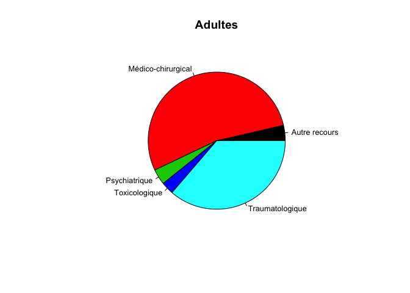

# Analyse par codes de regroupement
JcB  
03/12/2014  

source: Stat Resural/Codes regroupement_ORUMIP/analyse_regroup.Rmd

Analyse du fichier transmis par l'ORUMIP
========================================
 
Le fichier Regroupements ORUMiP Thésaurus SFMU.csv doit être enregistré en inclant les guillemets entre les différents champs à cause des apostophes. La ligne 1 doit être supprimée.

dictionnaire des termes
-----------------------
- GAUX: signes généraux et autres pathologies
- MLSV: malaises, syncope

Le fichier de travail __d3__ est préparé à partir de __d14__ pour les données 2014 et le fichier de regroupement de l'Orumip (version 2). Les fichiers sources sont mergés sur la base des codes CIM10. Les codes CIM10 Orumip respectent la nomenclature PMSI avec des détails supplémentaires précédés du signe +.

Pour le calcul des horaires de PDS il faut rajouter le fichier __Trame commune/horaires_pds.Rda__.

Le 6/6/2015 ajout de la colonne SORTIE dans d3 pour pouvoir calculer une durée de présence en fonction de la pathologie.


```r
library(knitr)
options(scipen = 6, digits = 2)

# # Pour MAC:
# path <- "Regroupement_ORUMIP"
# d <- read.csv2(paste(path, file2, sep="/"), skip = 1)
# load("../RPU_2014/rpu2014d0112_c2.Rda") # d14
# load("~/Documents/RESURAL/Trame_Commune/horaires_pds.Rda") #h.pds
# 
# # 
# # Pour XPS
# # path <- "../Regroupement_ORUMIP"
# # file2 <- "REGROUPEMENT-CIM10-FEDORU-V2.csv"
# 
# # on récupère la nomenclature de l'Orumip
# d <- read.csv2(paste(path, file2, sep="/"), skip = 1)
# # save(d, file = "../Regroupement_ORUMIP/REGROUPEMENT-CIM10-FEDORU-V2.Rda")
# 
# # # DP 2014
# # load("~/Documents/Resural/Stat Resural/RPU_2014/rpu2014d0112_c2.Rda") # d14
# 
# # Ajout des horaires de PDS
# d14$HPDS <- h.pds
# 
# # Sélestion des colonnes utiles
# dpr2 <- d14[!is.na(d14$DP), c("DP","CODE_POSTAL","ENTREE","SORTIE", "FINESS","GRAVITE","ORIENTATION","MODE_SORTIE","AGE","SEXE","TRANSPORT","DESTINATION","NAISSANCE", "HPDS")]
# 
# # correction des caractères bloquants
# dpr2$DP<-gsub("\xe8","è",as.character(dpr2$DP),fixed=FALSE)
# dpr2$DP<-gsub("\xe9","é",as.character(dpr2$DP),fixed=FALSE)
# 
# # suppression des points décimaux
# dpr2$DP <- gsub(".", "", dpr2$DP, fixed=TRUE)
# 
# # suppression des minuscules
# dpr2$DP <- toupper(dpr2$DP)
# # save(dpr2, file = "dpr2.Rda")
# 
# # on réalise un merging des deux fichiers sur la base du code CIM 10
# d3 <- merge(dpr2, d, by.x = "DP", by.y = "Code", all.x = TRUE)
# save(d3, file = "d3.Rda") # d3
# 
# # ménage
# rm(d14, d, dpr2)
```

Création  d'un nouveau fichier août 2015
========================================

L'objectif est de créer un fichier résultant du merging des RPU 2015 et des codes de regroupement ORUMIP.

Récupération des codes de regroupement
--------------------------------------
Les codes de regroupement sont fournis sous forme d'un classeur Excel.

- création d'un nouveau dossier: Regroupement_ORUMIP/Regroupement_ORUMIP/
- on y met __Regroupements ORUMiP Thésaurus SFMU.xlsx__
- on sauvegarde la page 2 au format .CSV2 (semi-colon) car le tableur posssède des rubriques où les mots sont séparés par des virgules, sous le nom de __Regroupements_ORUMiP.csv__.

```{}
# pour mac en mode console
path <- "Regroupement_ORUMIP/Regroupement_ORUMIP/"
file <- "Regroupements_ORUMiP.csv"
orumip <- read.csv2(paste0(path, file), skip = 1)
names(orumip)
```

On renomme les entête de colonnes
```{}
x <- c("CIM10", "CODE_URGENCE", "LIBELLE_URGENCE", "CODE_DISCIPLINE", "LIBELLE_DISCIPLINE","CODE_PATHOLOGIE", "LIBELLE_PATHOLOGIE")
names(orumip) <- x
```

Récupération des RPU 2015
-------------------------
Le ficher des RPU récupéré et nettoyé est sauvegardé sous le nom de __dpr2.Rda__.

Lecture du fichier des RPU 2015
```{}
load("../RPU_2014/rpu2015d0112_provisoire.Rda") # d15
# load("~/Documents/RESURAL/Trame_Commune/horaires_pds.Rda") #h.pds

# On ne garde que les RPU avec un DP
dpr2 <- d15[!is.na(d15$DP), ]
```

supression des caractères anormaux
```{}
Encoding(dpr2$DP) <- "latin1"
Encoding(dpr2$MOTIF) <- "latin1"
```

suppression des points décimaux
```{}
dpr2$DP <- gsub(".", "", dpr2$DP, fixed=TRUE)
```

suppression des minuscules
```{}
dpr2$DP <- toupper(dpr2$DP)
```

Sauvegarde du fichier dpr2
```{}
save(dpr2, file = "Regroupement_ORUMIP/Regroupement_ORUMIP/dpr2.Rda")
```

Merging des 2 fichiers
-----------------------
Le fichier résultant est sauvegardé sous le nom de __merge2015.Rda__.

on réalise un merging des deux fichiers sur la base du code CIM 10
```{}
merge2015 <- merge(dpr2, orumip, by.x = "DP", by.y = "CIM10", all.x = TRUE)
save(merge2015, file = "Regroupement_ORUMIP/Regroupement_ORUMIP/merge2015.Rda") # merge2015
```

Analyse rapide
--------------
On utilise le fichier __merge2015.Rda__ créé à l'étape précédente, résultant du croisement des RPU 2015 (au 31 juillet 2015) et des code de regroupement ORUMIP.


```r
load("../Regroupement_ORUMIP/Regroupement_ORUMIP/merge2015.Rda")
table(merge2015$CODE_URGENCE)
```

```
## 
##    AUTRE MED-CHIR      PSY   TOXICO   TRAUMA 
##     3948    73057     3096     1243    54522
```

```r
table(merge2015$CODE_DISCIPLINE)
```

```
## 
##      AUTRE    CARDIOV    DERMATO   DIGESTIF       GAUX   INFECTIO 
##       3948       6388       5819      15666       4919       3667 
##      INTOX       MLSV      NEURO      ORLOS     PNEUMO        PSY 
##       1243       4685       5852       9090       6613       3096 
##    RHUMATO  TRAU_MINF  TRAU_MSUP    TRAU_SP TRAU_TETEC TRAU_TRONC 
##       3701      17520      20837        908      11672       3585 
##     UROGEN 
##       6657
```

```r
table(merge2015$CODE_PATHOLOGIE)
```

```
## 
##     AUTRE01     AUTRE02     AUTRE03     AUTRE04     AUTRE05     AUTRE06 
##         952        1455         153          92         809         405 
##     AUTRE07   CARDIOV01   CARDIOV02   CARDIOV03   CARDIOV04   CARDIOV05 
##          82         183          73         195          27        2684 
##   CARDIOV06   CARDIOV07   CARDIOV08   CARDIOV09   CARDIOV10   CARDIOV11 
##         371         128         146        1226          71         327 
##   CARDIOV12   CARDIOV13   CARDIOV14     CONT_LS   DERMATO01   DERMATO02 
##          95         707         155       17603        1929         424 
##   DERMATO03   DERMATO04   DERMATO05   DERMATO06   DERMATO07   DERMATO08 
##         597         498         152         290         171         901 
##   DERMATO09   DERMATO10    DIGEST01    DIGEST02    DIGEST03    DIGEST04 
##         454         403         141         303        2347        2734 
##    DIGEST05    DIGEST06    DIGEST07    DIGEST08    DIGEST09    DIGEST10 
##        5348         616         326         669         850         481 
##    DIGEST11    DIGEST12    DIGEST13    DIGEST14    DIGEST15      GAUX01 
##         328         203          86         591         643        1456 
##      GAUX02      GAUX03      GAUX04      GAUX05      GAUX06  INFECTIO01 
##         855         484         509        1233         382        1522 
##  INFECTIO02  INFECTIO03  INFECTIO04  INFECTIO05     INTOX01     INTOX02 
##        1104         228         270         543         340          53 
##     INTOX03     INTOX04     MB_ELUX    MB_FRACT      MSLV01      MSLV02 
##         734         116        9629        7889        2581         397 
##      MSLV03     NEURO01     NEURO02     NEURO03     NEURO04     NEURO05 
##        1707         165        1515         179         345        1259 
##     NEURO06     NEURO07     NEURO08     ORLOS01     ORLOS02     ORLOS03 
##          80        1846         463        3806         794        1864 
##     ORLOS04     ORLOS05     ORLOS06     ORLOS07     ORLOS08   PLAIES_CE 
##         963         532         852         265          14       13075 
##    PNEUMO01    PNEUMO02    PNEUMO03    PNEUMO04    PNEUMO05    PNEUMO06 
##         760         618        1131        1020         327         103 
##    PNEUMO07    PNEUMO08    PNEUMO09    PNEUMO10    PNEUMO11       PSY01 
##         407         144        1921         134          48         588 
##       PSY02       PSY03       PSY04   RHUMATO01   RHUMATO02   RHUMATO03 
##        1466         557         485        1009         170         198 
##   RHUMATO04   RHUMATO05   RHUMATO06   RHUMATO07  TRAU_COTES  TRAU_CRANE 
##         337        1033         794         160         428        2535 
##    TRAU_ODM   TRAU_OPHT   TRAU_PROF TRAU_RACHIS     TRAU_SP    UROGEN01 
##         443         846         635         841         598        1829 
##    UROGEN02    UROGEN03    UROGEN04    UROGEN05    UROGEN06    UROGEN07 
##         139         351          65         324        2196         303 
##    UROGEN08    UROGEN09    UROGEN10    UROGEN11    UROGEN12    UROGEN13 
##          48         271         679         277         103          72
```

```r
# table des CODE_URGENCE par FINESS
t <- tapply(merge2015$CODE_URGENCE, list(merge2015$FINESS, merge2015$CODE_URGENCE), length)
t
```

```
##     AUTRE MED-CHIR  PSY TOXICO TRAUMA
## 3Fr   239     2385   80      1   1805
## Alk    87      543   25      1    837
## Ane    NA       NA   NA     NA     NA
## Col  1267    14384  736    212  12046
## Dia   284     2832   59     NA   1882
## Dts    NA      435   NA     NA   3323
## Geb   254     3016   67     35   4061
## Hag   350     9840  232    157   6458
## Hus   185    11030  212    284   4656
## Mul   639    12203 1241    254   5715
## Odi    51     2171   36     NA   1655
## Ros    NA       NA   NA     NA      2
## Sav    56     1071   62     30   1400
## Sel   290     5578  108     94   6113
## Wis   161     2865  136     25   2412
## HTP    65     2935   58     55   2049
## NHC    20     1769   44     95    108
```

```r
# total colonne et pourcentage
a <- apply(t, 2, sum, na.rm = TRUE) # somme des colonnes
a
```

```
##    AUTRE MED-CHIR      PSY   TOXICO   TRAUMA 
##     3948    73057     3096     1243    54522
```

```r
round(a * 100/sum(a), 2)
```

```
##    AUTRE MED-CHIR      PSY   TOXICO   TRAUMA 
##     2.91    53.77     2.28     0.91    40.13
```

```r
# somme d'une ligne
b <- apply(t, 1, sum, na.rm = TRUE)
round(t*100/b, 2)
```

```
##     AUTRE MED-CHIR  PSY TOXICO TRAUMA
## 3Fr  5.30       53 1.77   0.02   40.0
## Alk  5.83       36 1.67   0.07   56.1
## Ane    NA       NA   NA     NA     NA
## Col  4.42       50 2.57   0.74   42.0
## Dia  5.62       56 1.17     NA   37.2
## Dts    NA       12   NA     NA   88.4
## Geb  3.42       41 0.90   0.47   54.6
## Hag  2.05       58 1.36   0.92   37.9
## Hus  1.13       67 1.30   1.74   28.4
## Mul  3.19       61 6.19   1.27   28.5
## Odi  1.30       55 0.92     NA   42.3
## Ros    NA       NA   NA     NA  100.0
## Sav  2.14       41 2.37   1.15   53.5
## Sel  2.38       46 0.89   0.77   50.2
## Wis  2.88       51 2.43   0.45   43.1
## HTP  1.26       57 1.12   1.07   39.7
## NHC  0.98       87 2.16   4.67    5.3
```

```r
# manipulation d'une ligne
t['NHC',]
```

```
##    AUTRE MED-CHIR      PSY   TOXICO   TRAUMA 
##       20     1769       44       95      108
```

```r
sum(t['NHC',])
```

```
## [1] 2036
```

```r
t['NHC',] / sum(t['NHC',])
```

```
##    AUTRE MED-CHIR      PSY   TOXICO   TRAUMA 
##   0.0098   0.8689   0.0216   0.0467   0.0530
```

```r
round(t['NHC',]*100 / sum(t['NHC',]), 2)
```

```
##    AUTRE MED-CHIR      PSY   TOXICO   TRAUMA 
##     0.98    86.89     2.16     4.67     5.30
```

```r
# table des CODE_DISCIPLINE par FINESS
t <- tapply(merge2015$CODE_DISCIPLINE, list(merge2015$FINESS, merge2015$CODE_DISCIPLINE), length)
```


Analyse
=======

```r
library(epicalc)
```

```
## Loading required package: foreign
## Loading required package: survival
## Loading required package: MASS
## Loading required package: nnet
```

```r
path <- "../" # path <- "" en mode console
load(paste0(path, "d3.Rda")) # d3 est le fichier mergé
source(paste0(path,"regroupement.R"))

# on réalise un merging des deux fichiers sur la base du code CIM 10
# d3 <- merge(dpr2, d, by.x = "DP", by.y = "Code", all.x = TRUE)

# affichage des résultats
summary(d3$TYPE.URGENCES)
```

```
##      Autre recours Médico-chirurgical      Psychiatrique 
##               7441             136816               6185 
##      Toxicologique    Traumatologique               NA's 
##               4847              91907               1170
```

```r
summary(d3$CHAPITRE)
```

```
##                                      autre et sans précision 
##                                                          196 
##                Céphalées, pathologies neurologiques hors SNP 
##                                                        10813 
##            Demande de certificats, de dépistage, de conseils 
##                                                         2937 
##          Dermato-allergologie et atteintes cutanéo-muqueuses 
##                                                         9195 
##                Difficultés psychosociales, socio-économiques 
##                                                          594 
##                 Douleurs abdominales, pathologies digestives 
##                                                        25893 
##            Douleurs de membre, rhumatologie, orthopédie, SNP 
##                                                        15907 
##               Douleurs pelviennes, pathologies uro-génitales 
##                                                        10745 
##         Douleurs thoraciques, pathologies cardio-vasculaires 
##                                                        11395 
##        Dyspnées, pathologies des voies aériennes inférieures 
##                                                        12828 
##                             Fièvre et infectiologie générale 
##                                                         4387 
##             Iatrogénie et complication post chirurgicale SAI 
##                                                         1650 
##                                      Intoxication alcoolique 
##                                                         2552 
##                          Intoxication au monoxyde de carbone 
##                                                          106 
##                                  Intoxication médicamenteuse 
##                                                         1819 
##                         Intoxication par d'autres substances 
##                                                          370 
## Malaises, lipothymies, syncopes, étourdissements et vertiges 
##                                                         7572 
##            ORL, ophtalmo, stomato et carrefour aéro-digestif 
##                                                        18051 
##      Recours lié à l'organisation de la continuité des soins 
##                                                          464 
##                      Réorientations, fugues,  refus de soins 
##                                                         1018 
##                        Signes généraux et autres pathologies 
##                                                        10030 
##                Soins de contrôle, surveillances et entretien 
##                                                          582 
##                          Traumatisme autre et sans précision 
##                                                         5200 
##                             Traumatisme de la tête et du cou 
##                                                        21004 
##                              Traumatisme du membre inférieur 
##                                                        27465 
##                              Traumatisme du membre supérieur 
##                                                        32512 
##                         Traumatisme thoraco-abdomino-pelvien 
##                                                         5726 
##            Troubles du psychisme, pathologies psychiatriques 
##                                                         6185 
##                                                         NA's 
##                                                         1170
```

```r
summary(d3$SOUS.CHAPITRE)
```

```
##               Contusions et lésions superf cutanéo-muqueuses (hors plaies et CE) 
##                                                                            25482 
##                                        Plaies et corps étrangers cutanéo-muqueux 
##                                                                            20221 
##                                                              Fractures de membre 
##                                                                            15455 
##                                                  Entorses et luxations de membre 
##                                                                            13802 
##                                                                                - 
##                                                                            12288 
##                                                Douleur abdominale sans précision 
##                                                                             7120 
##                                    Angines, amygdalites, rhino-pharyngites, toux 
##                                                                             6969 
##                                                            Traumatismes crâniens 
##                                                                             5813 
##                                                      Diarrhée et gastro-entérite 
##                                                                             5088 
##                                 Douleur oculaire, conjonctivites, autre ophtalmo 
##                                                                             5006 
##                                               Malaises sans PC ou sans précision 
##                                                                             4506 
##                                          Arthralgie, arthrites, tendinites,  ... 
##                                                                             4471 
##                                      Lombalgie, lombo-sciatique, rachis lombaire 
##                                                                             4401 
##                                      Lésions traumatique autre et sans précision 
##                                                                             4121 
##                                                                     Pneumopathie 
##                                                                             3827 
##                                   Douleur précordiale ou thoracique non élucidée 
##                                                                             3775 
##                                                    Infection des voies urinaires 
##                                                                             3599 
##                             Constipation et autre trouble fonctionnel intestinal 
##                                                                             3582 
##                                     AVC, AIT, hémiplégie et syndrômes apparentés 
##                                                                             3041 
##                    Douleurs aiguës et chroniques non précisées, soins palliatifs 
##                                                                             2714 
##                                                            Migraine et céphalées 
##                                                                             2675 
##                                     Douleur de membre, contracture, myalgie, ... 
##                                                                             2633 
##                                                    Abcès, phlegmons, furoncles,… 
##                                                                             2624 
##                              Angoisse, stress, trouble névrotique ou somatoforme 
##                                                                             2503 
##                                         Colique néphrétique et lithiase urinaire 
##                                                                             2436 
##                                                  Bronchite aiguë et bronchiolite 
##                                                                             2382 
##                                             Vertiges et sensations vertigineuses 
##                                                                             2352 
##                                 Otalgie, otites et autre pathologies otologiques 
##                                                                             2330 
##                                                         Epilepsie et convulsions 
##                                                                             2326 
##                                        AEG, asthénie, syndrôme de glissement, .. 
##                                                                             2249 
##                                                 Lésions de l'oeil ou de l'orbite 
##                                                                             2158 
##                                                           Insuffisance cardiaque 
##                                                                             2099 
##                                            Trouble du rythme et de la conduction 
##                                                                             1887 
## Lésion prof des tissus (tendons, vx, nerfs,..) ou d'organes internes  (hors TC)  
##                                                                             1876 
##                                                                           Asthme 
##                                                                             1789 
##                                                                           Fièvre 
##                                                                             1723 
##                            Agitation, trouble de personnalité et du comportement 
##                                                                             1720 
##                                    Anémie, aplasie, autre atteinte hématologique 
##                                                                             1566 
##                                                   Douleur dentaire, stomatologie 
##                                                                             1485 
##                                                     Dyspnée et gène respiratoire 
##                                                                             1453 
##                                                     Douleur thoracique pariétale 
##                                                                             1429 
##                                    autres pathologies digestives et alimentaires 
##                                                                             1418 
##                          Entorses, luxations et fractures du rachis ou du bassin 
##                                                                             1387 
##                                                                        Urticaire 
##                                                                             1372 
##                                  autres infectiologie générale et sans précision 
##                                                                             1368 
##                                            autres pathologies et signes généraux 
##                                                                             1362 
##                                                                      Proctologie 
##                                                                             1256 
##                        Lithiase, infection et autre atteinte des voies biliaires 
##                                                                             1217 
##                                      BPCO et insuffisance respiratoire chronique 
##                                                                             1154 
##                                                            Nausées, vomissements 
##                                                                             1111 
##                                                                        Epistaxis 
##                                                                             1108 
##                                  Déshydratation et trouble hydro-électrolytiques 
##                                                                             1076 
##                                       autre rhumato et syst nerveux périphérique 
##                                                                             1064 
##                                               Diabète et troubles de la glycémie 
##                                                                             1063 
##                                            Schizophrénie, délire, hallucinations 
##                                                                              994 
##                                               Dépression et troubles de l'humeur 
##                                                                              968 
##                               Cervicalgie, névralgie et autre atteinte cervicale 
##                                                                              958 
##                                Gastrite, Ulcère Gastro-duodénal non hémorragique 
##                                                                              956 
##                                   Troubles sensitifs, moteurs et toniques autres 
##                                                                              953 
##                                      Dorsalgie et pathologie rachidienne dorsale 
##                                                                              951 
##                                         Rétention urinaire, pb de sonde, dysurie 
##                                                                              937 
##                                                        Viroses cutanéo-muqueuses 
##                                                                              929 
##                                                  Insuffisance respiratoire aiguë 
##                                                                              916 
##                                                          Occlusion toute origine 
##                                                                              878 
##                                                                        Érysipèle 
##                                                                              819 
##                                                     Erythème et autres éruptions 
##                                                                              809 
##                                                   autre affection dermatologique 
##                                                                              807 
##                                  Fractures OPN, dents et lésions de la mâchoire  
##                                                                              806 
##                                   Entorses, fractures et lésions costo-sternales 
##                                                                              786 
##                                  Laryngite, trachéite et autre atteinte laryngée 
##                                                                              765 
##                                             Dermite atopique, de contact, prurit 
##                                                                              745 
##                                             Désorientation et troubles cognitifs 
##                                                                              737 
##                                   Appendicite et autre pathologie appendiculaire 
##                                                                              732 
##                                        Syncopes, lipothymies et malaises avec PC 
##                                                                              714 
##                                                    HTA et poussées tensionnelles 
##                                                                              712 
##                                           Angor et autre cardiopathie ischémique 
##                                                                              686 
##                                         Douleur testiculaire et autre andrologie 
##                                                                              680 
##                                Vulvo-vaginites, salpingites et autre gynécologie 
##                                                                              638 
##                                                   Ascite, ictère et hépatopathie 
##                                                                              628 
##                        Comas, tumeurs, encéphalopathies et autre atteinte du SNC 
##                                                                              619 
##                                         Oesophagite et reflux gastro-oesophagien 
##                                                                              572 
##                                                              Insuffisance rénale 
##                                                                              565 
##                                  Hémorragie digestive sans mention de péritonite 
##                                                                              555 
##                                  Pancréatite aiguë et autre atteinte du pancréas 
##                                                                              552 
##                                  Sujet en contact avec une maladie transmissible 
##                                                                              537 
##                                                               Embolie pulmonaire 
##                                                                              525 
##                                                            Phlébite périphérique 
##                                                                              508 
##                                                  autres patho cardio-vasculaires 
##                                                                              506 
##                                                    Prostatite, orchi-épididymite 
##                                                                              472 
##                                                            Septicémies et sepsis 
##                                                                              470 
##                                                  Oedeme et tuméfaction localisés 
##                                                                              455 
##                                                                        Hématurie 
##                                                                              449 
##                                                            Infarctus du myocarde 
##                                                                              436 
##                                            Piqûres d'arthropode, d'insectes, ... 
##                                                                              356 
##                                                   Sinusites aiguës et chroniques 
##                                                                              313 
##                                                      Atteintes de nerfs crâniens 
##                                                                              310 
##                                                                           Grippe 
##                                                                              289 
##                               Mycoses, parasitoses et autres infections cutanées 
##                                                                              279 
##                                                                          (Other) 
##                                                                             2992 
##                                                                             NA's 
##                                                                             1170
```

```r
tapply(merge2015$CODE_URGENCE, list(merge2015$FINESS, merge2015$CODE_URGENCE), length)
```

```
##     AUTRE MED-CHIR  PSY TOXICO TRAUMA
## 3Fr   239     2385   80      1   1805
## Alk    87      543   25      1    837
## Ane    NA       NA   NA     NA     NA
## Col  1267    14384  736    212  12046
## Dia   284     2832   59     NA   1882
## Dts    NA      435   NA     NA   3323
## Geb   254     3016   67     35   4061
## Hag   350     9840  232    157   6458
## Hus   185    11030  212    284   4656
## Mul   639    12203 1241    254   5715
## Odi    51     2171   36     NA   1655
## Ros    NA       NA   NA     NA      2
## Sav    56     1071   62     30   1400
## Sel   290     5578  108     94   6113
## Wis   161     2865  136     25   2412
## HTP    65     2935   58     55   2049
## NHC    20     1769   44     95    108
```


Commentaires
------------
Au moment du merging on veut que toute la colonne DP soit prise en compte. Il faut donc préciser _all.x = TRUE_ 
. 

Explications: [How to Use the merge() Function with Data Sets in R](http://www.dummies.com/how-to/content/how-to-use-the-merge-function-with-data-sets-in-r.html). Les codes n'ayant pas de correspondance FEDORU sont marqués NA. 

Type d'urgence
---------------

```r
n.type <- nrow(d3)
s.type <- summary(d3$TYPE.URGENCES)
s.type
```

```
##      Autre recours Médico-chirurgical      Psychiatrique 
##               7441             136816               6185 
##      Toxicologique    Traumatologique               NA's 
##               4847              91907               1170
```

```r
pie(s.type)
```

 

```r
barplot(sort(s.type, decreasing = TRUE), las = 2, cex.names = 0.6, main = "Répartition des diagnostics principaux \nselon les codes de regroupement de l' ORUMIP")
```

 

```r
tab1(d3$TYPE.URGENCES, sort.group = "decreasing", cex.names = 0.6, main = "Répartition des diagnostics principaux \nselon les codes de regroupement de l' ORUMIP")
```

 

```
## d3$TYPE.URGENCES : 
##                    Frequency   %(NA+)   %(NA-)
## Médico-chirurgical    136816     55.1     55.3
## Traumatologique        91907     37.0     37.2
## Autre recours           7441      3.0      3.0
## Psychiatrique           6185      2.5      2.5
## Toxicologique           4847      2.0      2.0
## NA's                    1170      0.5      0.0
##   Total               248366    100.0    100.0
```
1170 codes de sont pas reconnus (`s.type["NA's"]*100/n.type` %).


```r
a <- d3[is.na(d3$TYPE.URGENCES),]
cbind(summary(as.factor(a$DP)))
```

```
##         [,1]
## H60,9     47
## Y3492     46
## S525 01   36
## S525 02   36
## R073 01   27
## S422 01   23
## S818 01   23
## S818 02   20
## S826 02   17
## S422 02   16
## G580 01   14
## S202 01   13
## S826 01   13
## S934 02   13
## S202 02   12
## S223 02   12
## S424 02   12
## S860 02   12
## S903 02   12
## S810 01   11
## S824 01   11
## S824 02   11
## T159 02   11
## S011 02   10
## S424 01   10
## S521 01   10
## S526 02   10
## S510 02    9
## S521 02    9
## S729 01    9
## S810 02    9
## S903 01    9
## S923 01    9
## S934 01    9
## J189 01    8
## M751 02    8
## R073 02    8
## S518 02    8
## S823 02    8
## S923 02    8
## S924 01    8
## H919 01    7
## N23 02     7
## S400 01    7
## S400 02    7
## S510 01    7
## S800 01    7
## M751 01    6
## N23 01     6
## S011 01    6
## S431 01    6
## S526 01    6
## S531 01    6
## S711 01    6
## S720 01    6
## S720 02    6
## S800 02    6
## S801 02    6
## S924 02    6
## S223 01    5
## S431 02    5
## S498 01    5
## S500 01    5
## S518 01    5
## S602 02    5
## S701 01    5
## S701 02    5
## S801 01    5
## S825 01    5
## S834 01    5
## V4259      5
## G580 02    4
## H612 02    4
## H920 02    4
## S015 01    4
## S430 02    4
## S522 02    4
## S523 02    4
## S711 02    4
## S729 02    4
## S821 02    4
## S823 01    4
## S836 01    4
## S900 01    4
## S913 01    4
## S913 02    4
## S929 02    4
## S936 01    4
## T159 01    4
## V4608      4
## G500 01    3
## H539 01    3
## H539 02    3
## H920 01    3
## I802 02    3
## J939 02    3
## S270 01    3
## S420 01    3
## S434 02    3
## (Other)  286
```
- Plus de la moitié des codes concernent __R53+0__, __R53+1__ et __R53+2__ qui sont des codes PMSI. _R53_ = Malaise et fatigue.
- r11 = vomissements: pb de casse
- B99+1 = Syndrome infectieux sans cause trouvée

Par type d'urgence
==================

Le regroupement principal de l'ORUMIP comprend les chapitres suivants:

```
[1] "Autre recours"      "Médico-chirurgical" "Psychiatrique"     
[4] "Toxicologique"      "Traumatologique"   
```

Analyse des urgences médico-chirurgicales
-----------------------------------------

```r
s.type <- summary(d3$TYPE.URGENCES)
sort(s.type, decreasing = TRUE)
```

```
## Médico-chirurgical    Traumatologique      Autre recours 
##             136816              91907               7441 
##      Psychiatrique      Toxicologique               NA's 
##               6185               4847               1170
```

```r
medic <- d3[d3$TYPE.URGENCES == "Médico-chirurgical",]

tab1(factor(medic$CHAPITRE), sort.group = "decreasing", bar.values = "percent", cex.names = 0.8, main = "Médico-chirurgical")
```

 

```
## factor(medic$CHAPITRE) : 
##                                                              Frequency
## Douleurs abdominales, pathologies digestives                     25893
## ORL, ophtalmo, stomato et carrefour aéro-digestif                18051
## Douleurs de membre, rhumatologie, orthopédie, SNP                15907
## Dyspnées, pathologies des voies aériennes inférieures            12828
## Douleurs thoraciques, pathologies cardio-vasculaires             11395
## Céphalées, pathologies neurologiques hors SNP                    10813
## Douleurs pelviennes, pathologies uro-génitales                   10745
## Signes généraux et autres pathologies                            10030
## Dermato-allergologie et atteintes cutanéo-muqueuses               9195
## Malaises, lipothymies, syncopes, étourdissements et vertiges      7572
## Fièvre et infectiologie générale                                  4387
## NA's                                                              1170
##   Total                                                         137986
##                                                                %(NA+)
## Douleurs abdominales, pathologies digestives                     18.8
## ORL, ophtalmo, stomato et carrefour aéro-digestif                13.1
## Douleurs de membre, rhumatologie, orthopédie, SNP                11.5
## Dyspnées, pathologies des voies aériennes inférieures             9.3
## Douleurs thoraciques, pathologies cardio-vasculaires              8.3
## Céphalées, pathologies neurologiques hors SNP                     7.8
## Douleurs pelviennes, pathologies uro-génitales                    7.8
## Signes généraux et autres pathologies                             7.3
## Dermato-allergologie et atteintes cutanéo-muqueuses               6.7
## Malaises, lipothymies, syncopes, étourdissements et vertiges      5.5
## Fièvre et infectiologie générale                                  3.2
## NA's                                                              0.8
##   Total                                                         100.0
##                                                                %(NA-)
## Douleurs abdominales, pathologies digestives                     18.9
## ORL, ophtalmo, stomato et carrefour aéro-digestif                13.2
## Douleurs de membre, rhumatologie, orthopédie, SNP                11.6
## Dyspnées, pathologies des voies aériennes inférieures             9.4
## Douleurs thoraciques, pathologies cardio-vasculaires              8.3
## Céphalées, pathologies neurologiques hors SNP                     7.9
## Douleurs pelviennes, pathologies uro-génitales                    7.9
## Signes généraux et autres pathologies                             7.3
## Dermato-allergologie et atteintes cutanéo-muqueuses               6.7
## Malaises, lipothymies, syncopes, étourdissements et vertiges      5.5
## Fièvre et infectiologie générale                                  3.2
## NA's                                                              0.0
##   Total                                                         100.0
```

Analyse des urgences médico-chirurgicales
-----------------------------------------
 

```
## factor(trauma$CHAPITRE) : 
##                                      Frequency   %(NA+)   %(NA-)
## Traumatisme du membre supérieur          32512     34.9     35.4
## Traumatisme du membre inférieur          27465     29.5     29.9
## Traumatisme de la tête et du cou         21004     22.6     22.9
## Traumatisme thoraco-abdomino-pelvien      5726      6.2      6.2
## Traumatisme autre et sans précision       5200      5.6      5.7
## NA's                                      1170      1.3      0.0
##   Total                                  93077    100.0    100.0
```

Par age
=======

Adultes (18 à 75 ans)
---------------------

```r
d3a <- d3[d3$AGE > 17 & d3$AGE < 76,]
n.adl <- nrow(d3a)

# table fréquence
s.type.adl <- table(d3a$TYPE.URGENCES)
s.type.adl
```

```
## 
##      Autre recours Médico-chirurgical      Psychiatrique 
##               5025              74304               5087 
##      Toxicologique    Traumatologique 
##               4135              50470
```

```r
# table des proportion
p.type.adl <- round(prop.table(s.type.adl) * 100, 2)
p.type.adl
```

```
## 
##      Autre recours Médico-chirurgical      Psychiatrique 
##                3.6               53.5                3.7 
##      Toxicologique    Traumatologique 
##                3.0               36.3
```

```r
pie(s.type.adl, main = "Adultes", cex=0.8, col = palette(heat.colors(6)))
```

 

```r
taba <- tab1(d3a$TYPE.URGENCES, sort.group = "decreasing", bar.values = "percent", cex.names = 0.8, main = paste0("Médico-chirurgical adulte (N = ", n.adl, ")"), missing = FALSE)
```

 


Pédiatrie (age < 18 ans)
------------------------

```r
d3p <- d3[d3$AGE < 18,]
n.ped<- nrow(d3p)

s.type.ped <- table(d3p$TYPE.URGENCES)
sort(s.type.ped, decreasing = TRUE)
```

```
## 
## Médico-chirurgical    Traumatologique      Autre recours 
##              38406              32954               1864 
##      Psychiatrique      Toxicologique 
##                698                525
```

```r
pie(s.type.ped, main = "Pédiatrie", cex=0.8, col = palette(heat.colors(6)))
```

 

```r
tabp <- tab1(d3p$TYPE.URGENCES, sort.group = "decreasing", bar.values = "percent", cex.names = 0.8, main = paste0("Médico-chirurgical pédiatrique (N = ", n.ped, ")"), missing = FALSE)
```

 

Gériatrie (age > 75 ans)
------------------------

```r
d3g <- d3[d3$AGE > 75,]
n.ger <- nrow(d3g)

s.type.ger <- table(d3g$TYPE.URGENCES)
sort(s.type.ger, decreasing = TRUE)
```

```
## 
## Médico-chirurgical    Traumatologique      Autre recours 
##              24106               8483                552 
##      Psychiatrique      Toxicologique 
##                400                187
```

```r
pie(sort(s.type.ger), main = "Gériatrie", cex=0.8, col = palette(heat.colors(6)))
```

 

```r
tabp <- tab1(d3g$TYPE.URGENCES, sort.group = "decreasing", bar.values = "percent", cex.names = 0.8, main = paste0("Médico-chirurgical gériatrique (N = ", n.ger, ")"), missing = FALSE)
```

 

Synthèse
--------

```r
# table de regroupement
t.type <- rbind(s.type.adl, s.type.ped, s.type.ger)
t.type
```

```
##            Autre recours Médico-chirurgical Psychiatrique Toxicologique
## s.type.adl          5025              74304          5087          4135
## s.type.ped          1864              38406           698           525
## s.type.ger           552              24106           400           187
##            Traumatologique
## s.type.adl           50470
## s.type.ped           32954
## s.type.ger            8483
```

```r
barplot(t.type)
```

 

```r
# en pourcentages
p.type <- round(prop.table(t.type, margin = 1)*100, 2)
p.type
```

```
##            Autre recours Médico-chirurgical Psychiatrique Toxicologique
## s.type.adl           3.6                 53          3.66          2.97
## s.type.ped           2.5                 52          0.94          0.71
## s.type.ger           1.6                 71          1.19          0.55
##            Traumatologique
## s.type.adl              36
## s.type.ped              44
## s.type.ger              25
```

```r
color <- c("red", "green", "yellow")
barplot(p.type, cex.names = 0.6)
```

 

```r
barplot(p.type, cex.names = 0.6, beside = TRUE, col = color, main = "Pathologies selon l'age")
legend("topright", legend = c("18-75 ans","0-18 ans","Sup.75 ans"), col = color, pch = 15)
```

 

Par chapitre
============

Adultes
--------
### Pathologie médico-chirurgicale

```r
medic.adl <- d3a[d3a$TYPE.URGENCES == "Médico-chirurgical",]
n.medic.adl <- nrow(medic.adl)
s.medic.adl <- table(factor(medic.adl$CHAPITRE))
p.medic.adl <- round(prop.table(s.medic.adl)*100, 2)
sort(p.medic.adl, decreasing = TRUE)
```

```
## 
##                 Douleurs abdominales, pathologies digestives 
##                                                         17.8 
##            Douleurs de membre, rhumatologie, orthopédie, SNP 
##                                                         16.4 
##         Douleurs thoraciques, pathologies cardio-vasculaires 
##                                                          9.6 
##            ORL, ophtalmo, stomato et carrefour aéro-digestif 
##                                                          9.6 
##               Douleurs pelviennes, pathologies uro-génitales 
##                                                          9.2 
##                Céphalées, pathologies neurologiques hors SNP 
##                                                          8.8 
##        Dyspnées, pathologies des voies aériennes inférieures 
##                                                          6.9 
## Malaises, lipothymies, syncopes, étourdissements et vertiges 
##                                                          6.5 
##          Dermato-allergologie et atteintes cutanéo-muqueuses 
##                                                          6.3 
##                        Signes généraux et autres pathologies 
##                                                          6.3 
##                             Fièvre et infectiologie générale 
##                                                          2.5
```

```r
tab1(factor(medic.adl$CHAPITRE), cex.names = 0.5, cex = 0.8, sort.group = "decreasing", main = "Médico-chir adultes", bar.values = "percent")
```

 

```
## factor(medic.adl$CHAPITRE) : 
##                                                              Frequency
## Douleurs abdominales, pathologies digestives                     13232
## Douleurs de membre, rhumatologie, orthopédie, SNP                12200
## Douleurs thoraciques, pathologies cardio-vasculaires              7161
## ORL, ophtalmo, stomato et carrefour aéro-digestif                 7125
## Douleurs pelviennes, pathologies uro-génitales                    6852
## Céphalées, pathologies neurologiques hors SNP                     6573
## Dyspnées, pathologies des voies aériennes inférieures             5120
## Malaises, lipothymies, syncopes, étourdissements et vertiges      4825
## Dermato-allergologie et atteintes cutanéo-muqueuses               4706
## Signes généraux et autres pathologies                             4657
## Fièvre et infectiologie générale                                  1853
## NA's                                                               775
##   Total                                                          75079
##                                                                %(NA+)
## Douleurs abdominales, pathologies digestives                     17.6
## Douleurs de membre, rhumatologie, orthopédie, SNP                16.2
## Douleurs thoraciques, pathologies cardio-vasculaires              9.5
## ORL, ophtalmo, stomato et carrefour aéro-digestif                 9.5
## Douleurs pelviennes, pathologies uro-génitales                    9.1
## Céphalées, pathologies neurologiques hors SNP                     8.8
## Dyspnées, pathologies des voies aériennes inférieures             6.8
## Malaises, lipothymies, syncopes, étourdissements et vertiges      6.4
## Dermato-allergologie et atteintes cutanéo-muqueuses               6.3
## Signes généraux et autres pathologies                             6.2
## Fièvre et infectiologie générale                                  2.5
## NA's                                                              1.0
##   Total                                                         100.0
##                                                                %(NA-)
## Douleurs abdominales, pathologies digestives                     17.8
## Douleurs de membre, rhumatologie, orthopédie, SNP                16.4
## Douleurs thoraciques, pathologies cardio-vasculaires              9.6
## ORL, ophtalmo, stomato et carrefour aéro-digestif                 9.6
## Douleurs pelviennes, pathologies uro-génitales                    9.2
## Céphalées, pathologies neurologiques hors SNP                     8.8
## Dyspnées, pathologies des voies aériennes inférieures             6.9
## Malaises, lipothymies, syncopes, étourdissements et vertiges      6.5
## Dermato-allergologie et atteintes cutanéo-muqueuses               6.3
## Signes généraux et autres pathologies                             6.3
## Fièvre et infectiologie générale                                  2.5
## NA's                                                              0.0
##   Total                                                         100.0
```
### Pathologie traumatique

```r
trauma.adl <- d3a[d3a$TYPE.URGENCES == "Traumatologique",]
n.trauma.adl <- nrow(trauma.adl)
s.trauma.adl <- table(factor(trauma.adl$CHAPITRE))
p.trauma.adl <- round(prop.table(s.trauma.adl)*100, 2)
sort(p.trauma.adl, decreasing = TRUE)
```

```
## 
##      Traumatisme du membre supérieur      Traumatisme du membre inférieur 
##                                 37.0                                 31.2 
##     Traumatisme de la tête et du cou Traumatisme thoraco-abdomino-pelvien 
##                                 18.1                                  7.4 
##  Traumatisme autre et sans précision 
##                                  6.3
```

```r
tab1(factor(trauma.adl$CHAPITRE), cex.names = 0.5, cex = 0.8, sort.group = "decreasing", main = "Traumatologie adultes", bar.values = "percent", horiz = TRUE)
```

 

```
## factor(trauma.adl$CHAPITRE) : 
##                                      Frequency   %(NA+)   %(NA-)
## Traumatisme du membre supérieur          18675     36.4     37.0
## Traumatisme du membre inférieur          15740     30.7     31.2
## Traumatisme de la tête et du cou          9141     17.8     18.1
## Traumatisme thoraco-abdomino-pelvien      3721      7.3      7.4
## Traumatisme autre et sans précision       3193      6.2      6.3
## NA's                                       775      1.5      0.0
##   Total                                  51245    100.0    100.0
```

Enfants
-------
### Pathologie médico-chirurgicale pédiatrique

```r
f <- groupe.pathologique(d3p, "medchir")
tab1(f$data, cex.names = 0.5, cex = 0.8, sort.group = "decreasing", main = "Médico-chir pédiatrique", bar.values = "percent")
```

 

```
## f$data : 
##                                                              Frequency
## ORL, ophtalmo, stomato et carrefour aéro-digestif                 9733
## Douleurs abdominales, pathologies digestives                      9551
## Dyspnées, pathologies des voies aériennes inférieures             3915
## Dermato-allergologie et atteintes cutanéo-muqueuses               3808
## Signes généraux et autres pathologies                             2410
## Douleurs pelviennes, pathologies uro-génitales                    2181
## Fièvre et infectiologie générale                                  2041
## Douleurs de membre, rhumatologie, orthopédie, SNP                 2010
## Céphalées, pathologies neurologiques hors SNP                     1522
## Malaises, lipothymies, syncopes, étourdissements et vertiges       861
## Douleurs thoraciques, pathologies cardio-vasculaires               374
## NA's                                                               264
##   Total                                                          38670
##                                                                %(NA+)
## ORL, ophtalmo, stomato et carrefour aéro-digestif                25.2
## Douleurs abdominales, pathologies digestives                     24.7
## Dyspnées, pathologies des voies aériennes inférieures            10.1
## Dermato-allergologie et atteintes cutanéo-muqueuses               9.8
## Signes généraux et autres pathologies                             6.2
## Douleurs pelviennes, pathologies uro-génitales                    5.6
## Fièvre et infectiologie générale                                  5.3
## Douleurs de membre, rhumatologie, orthopédie, SNP                 5.2
## Céphalées, pathologies neurologiques hors SNP                     3.9
## Malaises, lipothymies, syncopes, étourdissements et vertiges      2.2
## Douleurs thoraciques, pathologies cardio-vasculaires              1.0
## NA's                                                              0.7
##   Total                                                         100.0
##                                                                %(NA-)
## ORL, ophtalmo, stomato et carrefour aéro-digestif                25.3
## Douleurs abdominales, pathologies digestives                     24.9
## Dyspnées, pathologies des voies aériennes inférieures            10.2
## Dermato-allergologie et atteintes cutanéo-muqueuses               9.9
## Signes généraux et autres pathologies                             6.3
## Douleurs pelviennes, pathologies uro-génitales                    5.7
## Fièvre et infectiologie générale                                  5.3
## Douleurs de membre, rhumatologie, orthopédie, SNP                 5.2
## Céphalées, pathologies neurologiques hors SNP                     4.0
## Malaises, lipothymies, syncopes, étourdissements et vertiges      2.2
## Douleurs thoraciques, pathologies cardio-vasculaires              1.0
## NA's                                                              0.0
##   Total                                                         100.0
```

### Pathologie traumatique pédiatrique

```r
f <- groupe.pathologique(d3p, "trau")
tab1(f$data, cex.names = 0.5, cex = 0.8, sort.group = "decreasing", main = "Traumatologie pédiatrique", bar.values = "percent")
```

 

```
## f$data : 
##                                      Frequency   %(NA+)   %(NA-)
## Traumatisme du membre supérieur          11702     35.2     35.5
## Traumatisme de la tête et du cou          9873     29.7     30.0
## Traumatisme du membre inférieur           8979     27.0     27.2
## Traumatisme autre et sans précision       1239      3.7      3.8
## Traumatisme thoraco-abdomino-pelvien      1161      3.5      3.5
## NA's                                       264      0.8      0.0
##   Total                                  33218    100.0    100.0
```

Gériatrie
---------
### Pathologie médico-chirurgicale gériatrique

```r
f <- groupe.pathologique(d3g, "medchir")
tab1(f$data, cex.names = 0.5, cex = 0.8, sort.group = "decreasing", main = "Médico-chir gériatrique", bar.values = "percent")
```

 

```
## f$data : 
##                                                              Frequency
## Douleurs thoraciques, pathologies cardio-vasculaires              3860
## Dyspnées, pathologies des voies aériennes inférieures             3793
## Douleurs abdominales, pathologies digestives                      3110
## Signes généraux et autres pathologies                             2963
## Céphalées, pathologies neurologiques hors SNP                     2718
## Malaises, lipothymies, syncopes, étourdissements et vertiges      1886
## Douleurs pelviennes, pathologies uro-génitales                    1712
## Douleurs de membre, rhumatologie, orthopédie, SNP                 1697
## ORL, ophtalmo, stomato et carrefour aéro-digestif                 1193
## Dermato-allergologie et atteintes cutanéo-muqueuses                681
## Fièvre et infectiologie générale                                   493
## NA's                                                               131
##   Total                                                          24237
##                                                                %(NA+)
## Douleurs thoraciques, pathologies cardio-vasculaires             15.9
## Dyspnées, pathologies des voies aériennes inférieures            15.6
## Douleurs abdominales, pathologies digestives                     12.8
## Signes généraux et autres pathologies                            12.2
## Céphalées, pathologies neurologiques hors SNP                    11.2
## Malaises, lipothymies, syncopes, étourdissements et vertiges      7.8
## Douleurs pelviennes, pathologies uro-génitales                    7.1
## Douleurs de membre, rhumatologie, orthopédie, SNP                 7.0
## ORL, ophtalmo, stomato et carrefour aéro-digestif                 4.9
## Dermato-allergologie et atteintes cutanéo-muqueuses               2.8
## Fièvre et infectiologie générale                                  2.0
## NA's                                                              0.5
##   Total                                                         100.0
##                                                                %(NA-)
## Douleurs thoraciques, pathologies cardio-vasculaires             16.0
## Dyspnées, pathologies des voies aériennes inférieures            15.7
## Douleurs abdominales, pathologies digestives                     12.9
## Signes généraux et autres pathologies                            12.3
## Céphalées, pathologies neurologiques hors SNP                    11.3
## Malaises, lipothymies, syncopes, étourdissements et vertiges      7.8
## Douleurs pelviennes, pathologies uro-génitales                    7.1
## Douleurs de membre, rhumatologie, orthopédie, SNP                 7.0
## ORL, ophtalmo, stomato et carrefour aéro-digestif                 4.9
## Dermato-allergologie et atteintes cutanéo-muqueuses               2.8
## Fièvre et infectiologie générale                                  2.0
## NA's                                                              0.0
##   Total                                                         100.0
```

### Pathologie traumatique gériatrique

```r
f <- groupe.pathologique(d3g, "trau")
tab1(f$data, cex.names = 0.5, cex = 0.8, sort.group = "decreasing", main = "Traumatologie gériatrique", bar.values = "percent")
```

 

```
## f$data : 
##                                      Frequency   %(NA+)   %(NA-)
## Traumatisme du membre inférieur           2746     31.9     32.4
## Traumatisme du membre supérieur           2135     24.8     25.2
## Traumatisme de la tête et du cou          1990     23.1     23.5
## Traumatisme thoraco-abdomino-pelvien       844      9.8      9.9
## Traumatisme autre et sans précision        768      8.9      9.1
## NA's                                       131      1.5      0.0
##   Total                                   8614    100.0    100.0
```

Synthèse
--------
Passages bruts:

```
Warning in rbind(s.type.ped, s.type.adl, s.type.ger, s.type): number of
columns of result is not a multiple of vector length (arg 1)
```

```
               Autre recours Médico-chirurgical Psychiatrique
< 18 ans                1864              38406           698
18-74 ans               5025              74304          5087
75 ans et plus           552              24106           400
TOTAL                   7441             136816          6185
               Toxicologique Traumatologique NA's
< 18 ans                 525           32954 1864
18-74 ans               4135           50470 5025
75 ans et plus           187            8483  552
TOTAL                   4847           91907 1170
```

Taux de passage standardisé pour 1000 RPU:


```
Warning in rbind(t1, t2, t3, t4): number of columns of result is not a
multiple of vector length (arg 1)
```

```
               Autre recours Médico-chirurgical Psychiatrique
< 18 ans                  25                516           9.4
18-74 ans                 36                534          36.6
75 ans et plus            16                715          11.9
TOTAL                     30                551          24.9
               Toxicologique Traumatologique NA's
< 18 ans                 7.0             443 25.0
18-74 ans               29.7             363 36.1
75 ans et plus           5.5             252 16.4
TOTAL                   19.5             370  4.7
```

 


AVC
===


```r
AVC<-d3[substr(d3$DP,1,3)>="I60" & substr(d3$DP,1,3)<"I65" | substr(d3$DP,1,3)=="G46" | substr(d3$DP,1,3)=="G45" ,]
AVC$etiologie <- NA
AVC$etiologie[substr(AVC$DP,1,3) %in% c("I60","I61","I62")] <-"HEMO"
AVC$etiologie[substr(AVC$DP,1,3) %in% c("I63","I64")] <-"ISCH"
AVC$etiologie[substr(AVC$DP,1,3) %in% c("I64")] <-"NPRE"
AVC$etiologie[substr(AVC$DP,1,3) %in% c("G45","G46")] <-"AIT"
AVC$etiologie <- as.factor(AVC$etiologie)

n.avc <- nrow(AVC)
```
RECUEIL DES DONNÉES
-------------------

- Nombre d’AVC dans l'année (+ rappeler le pourcentage d’exhaustivité du DP par rapport au nombre de RPU): __2949__
- Moyenne quotidienne d’AVC: __8.08 AVC/j__
- %  d’AVC dans l’activité globale: __1.19 %__

PATIENTS
--------

```
## c.age
##     [0,5)    [5,10)   [10,15)   [15,20)   [20,25)   [25,30)   [30,35) 
##        10         2         4        10        19        26        26 
##   [35,40)   [40,45)   [45,50)   [50,55)   [55,60)   [60,65)   [65,70) 
##        33        68        97       150       166       235       284 
##   [70,75)   [75,80)   [80,85)   [85,90)   [90,95)  [95,100) [100,105) 
##       295       393       496       408       193        28         4 
## [105,110) [110,115) [115,120) 
##         1         1         0
```

 

- Sex ratio: 0.95
- Age moyen: 71.44 ans
- Nombre d’AVC par sous classe d’âge (GT1):

ARRIVÉE
--------
- Nombre d’AVC et % par tranche d’heure GT1 (matinée, début d’après midi, fin d’après midi, soirée, nuit profonde)

```r
# heures de découpage
p <- c(0, 8, 12, 16, 20, 24)
# légende
np <- c("nuit profonde", "matinée", "début après-midi", "fin après-midi", "soirée")
# extraction des heures à partir du format datetime (http://stackoverflow.com/questions/19292438/split-date-time)
a <- as.numeric(format(as.POSIXct(AVC$ENTREE), "%H"))

x <- cut(a, p, np, right = FALSE)
x2 <- cut(a, p, right = FALSE)

rbind(levels(x2), table(x))
```

```
##      nuit profonde matinée  début après-midi fin après-midi soirée   
## [1,] "[0,8)"       "[8,12)" "[12,16)"        "[16,20)"      "[20,24)"
## [2,] "272"         "900"    "865"            "619"          "293"
```

```r
tab1(x, cex.names = 0.8, main = "Heure d'admission des AVC", bar.values = "percent", ylab = "%")
```

 

```
## x : 
##                  Frequency Percent Cum. percent
## nuit profonde          272     9.2          9.2
## matinée                900    30.5         39.7
## début après-midi       865    29.3         69.1
## fin après-midi         619    21.0         90.1
## soirée                 293     9.9        100.0
##   Total               2949   100.0        100.0
```

- %  passages en horaire de PDS


              PDSS   PDSWE   NPDS
-----------  -----  ------  -----
Nombre AVC     403     656   1890
% AVC           14      22     64

PDSS = horaires de PDS en semaine, PDSWE = horaires de PDS le WE, NPDS = hors horaire de PDS.

Mode d'arrivée aux urgences
---------------------------


```r
n.avc.moyen <- summary(factor(AVC$TRANSPORT))
n.avc.moyen
```

```
##  AMBU    FO  HELI PERSO  SMUR  VSAB  NA's 
##  1154     1    19   636    58   527   554
```

```r
p.avc.moyen <- round(prop.table(n.avc.moyen)*100, 2)
p.avc.moyen
```

```
##  AMBU    FO  HELI PERSO  SMUR  VSAB  NA's 
## 39.13  0.03  0.64 21.57  1.97 17.87 18.79
```
- %  d’arrivées Moyen perso
- %  d'arrivées SMUR
- %  d'arrivées VSAV
- %  d'arrivées ambulance privée
NB : commentaire possible pour expliquer que la somme des 4 pourcentages ci dessus ne fait pas 100 %


DIAGNOSTIC PRINCIPAL
--------------------

```r
t.diag <- table(AVC$etiologie)
p.diag <- prop.table(t.diag)*100
```

- Nombre d’AVC et %
- Nombre d’AIT et %
- Nombre de codes "symptomatiques" (hémiplégie, aphasie, amaurose, etc…) et %
- Nombre d’autres hémorragies non traumatiques et %

NB : se référer à l’annexe 4 pour les regroupements.

DURÉE
-----
- Durée de passage (HORS UHCD) : moyenne et médiane
- % de passages de moins de 4h

MODE DE SORTIE
--------------
- % d’hospitalisation
- % de mutation
- % de transfert
- % de retour à domicile

Résultats par type d'établissement
==================================

Latrame commune recueuille les éléments suivants:


```
                 Autre recours Médico-chirurgical Psychiatrique
SU SAMU CHU                 25                516           9.4
SU SAMU non CHU           1605              28855        2321.0
SU SMUR non SAMU          4093              69304        2836.0
SU non SMUR               1417              17941         505.0
TOTAL                     7441             136816        6185.0
                 Toxicologique Traumatologique
SU SAMU CHU                  7             443
SU SAMU non CHU           1223           13022
SU SMUR non SAMU          2487           53211
SU non SMUR                286           20056
TOTAL                     4847           91907
```

Une table des types


```r
x <- tapply(d3$TYPE.URGENCES, d3$FINESS, table ) # x est un vecteur de list
y <- x[-3] # on retire ste anne qui n'a aucun DP
z <- matrix(unlist(y), nrow = 14, ncol = 5) # on transforme y en matrice. Pour en faire un data frame: df <- df <- data.frame(matrix(unlist(y), nrow=14, byrow=T),stringsAsFactors=FALSE). Source: http://stackoverflow.com/questions/4227223/r-list-to-data-frame

rownames(z) <- names(x[-3]) # ok
colnames(z) <- names(unlist(x[1])) # ok mais pas terrible
```

